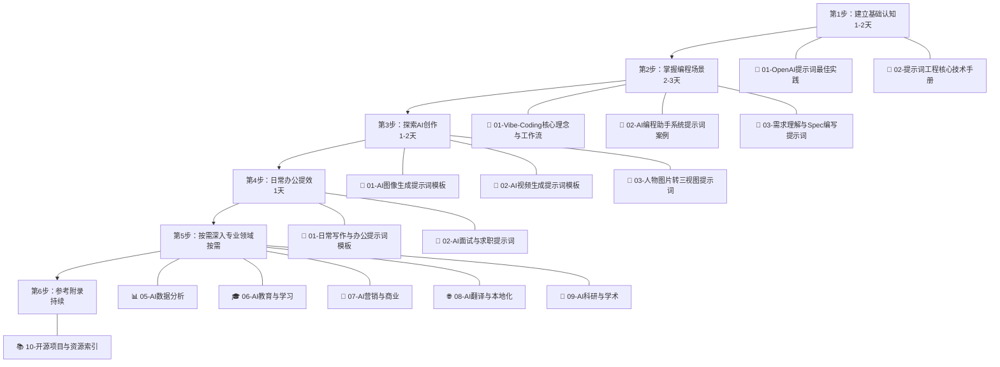

<small style="color:#888">📌 文档导航：学习路线 | [项目架构](02-项目架构.md) | [需求与路线图](03-需求与路线图.md) | [实施与质量](04-实施与质量.md) | [贡献者指南](05-贡献者指南.md)</small>

# 学习路线指南

## 路线总览

---

## 第1步：建立基础认知（1-2天）

### 1.1 必读：OpenAI 提示词最佳实践

📖 [01-OpenAI提示词最佳实践](../01-入门与理论/01-OpenAI提示词最佳实践.md)

- ⏱ 阅读时长：约 10 分钟
- 📌 核心内容：6 大策略（[写清晰的指令](../01-入门与理论/01-OpenAI提示词最佳实践.md#L9-L21) → [提供参考文本](../01-入门与理论/01-OpenAI提示词最佳实践.md#L24-L31) → [拆分复杂任务](../01-入门与理论/01-OpenAI提示词最佳实践.md#L35-L43) → [给模型思考时间](../01-入门与理论/01-OpenAI提示词最佳实践.md#L47-L55) → [使用外部工具](../01-入门与理论/01-OpenAI提示词最佳实践.md#L59-L67) → [系统性测试变更](../01-入门与理论/01-OpenAI提示词最佳实践.md#L71-L91)）
- 📋 快速参考卡片：[6大策略速查](../01-入门与理论/01-OpenAI提示词最佳实践.md#L94-L106)

### 1.2 核心：提示词工程核心技术手册

📖 [02-提示词工程核心技术手册](../01-入门与理论/02-提示词工程核心技术手册.md)

- ⏱ 阅读时长：全读约 45 分钟 / 精读前 5 章约 20 分钟
- 📌 核心内容：17 种提示词技术 + 6 个附录

**重点章节：

| 优先级 | 章节 | 为什么重要 |
|--------|------|------------|
| ⭐⭐⭐ | [零样本提示 & 少样本提示](../01-入门与理论/02-提示词工程核心技术手册.md#L9-L81) | 最基础的技术，所有场景的起点 |
| ⭐⭐⭐ | [链式思维（CoT）](../01-入门与理论/02-提示词工程核心技术手册.md#L85-L125) | 推理类任务的标配，GSM8K 提升 +18% |
| ⭐⭐⭐ | [系统提示](../01-入门与理论/02-提示词工程核心技术手册.md#L399-L447) | Agent 和编程助手的核心设计模式 |
| ⭐⭐ | [ReAct（推理+行动）](../01-入门与理论/02-提示词工程核心技术手册.md#L219-L248) | AI Agent 的基础范式 |
| ⭐⭐ | [结构化输出提示](../01-入门与理论/02-提示词工程核心技术手册.md#L357-L396) | 代码集成和自动化的必备技能 |
| ⭐⭐ | [提示链](../01-入门与理论/02-提示词工程核心技术手册.md#L302-L325) | 复杂工作流拆分，提升 +10-30% |
| ⭐ | [角色/人格提示](../01-入门与理论/02-提示词工程核心技术手册.md#L276-L298) | 专业领域任务的常用技巧 |
| ⭐ | [迭代优化 & 自我审查](../01-入门与理论/02-提示词工程核心技术手册.md#L493-L547) | 提升输出质量的关键方法 |
| ⭐ | [附录二：四字段标准结构](../01-入门与理论/02-提示词工程核心技术手册.md#L617-L627) | 写好提示词的通用框架 |
| ⭐ | [附录三：多模型适配对比表](../01-入门与理论/02-提示词工程核心技术手册.md#L630-L649) | 不同模型的选择和适配策略 |

### 自检清单

- [ ] 能说出 OpenAI 6 大策略中至少 4 个
- [ ] 理解零样本、少样本、CoT 的区别和适用场景
- [ ] 知道 ReAct 的"思考→行动→观察"循环
- [ ] 能用四字段结构（Role/Task/Constraints/Output Format）写一个提示词
- [ ] 理解系统提示与用户提示的区别

---

## 第2步：掌握 vibe coding 全流程（2-3天）

### 2.1 Vibe Coding 核心理念与工作流

📖 [01-Vibe-Coding核心理念与工作流](../02-编程开发/01-Vibe-Coding核心理念与工作流.md)

- ⏱ 阅读时长：约 25 分钟
- 📌 核心内容：7 类核心理念，覆盖 Vibe Coding 起源、Spec-Driven Development 四步法、Plan/Spec/Agent 模式对比、Agentic Coder 工作流、反模式避坑、人机协作边界设计
- 🔑 重点：建立 vibe coding 全流程认知，理解"意图→Spec→Plan→Execute→Verify"工作流主线

### 2.2 AI 编程助手系统提示词案例

📖 [02-AI编程助手系统提示词案例](../02-编程开发/02-AI编程助手系统提示词案例.md)

- ⏱ 阅读时长：约 30 分钟
- 📌 核心内容：4 大工具分析（[Cursor](../02-编程开发/02-AI编程助手系统提示词案例.md#L69-L175) / [Windsurf](../02-编程开发/02-AI编程助手系统提示词案例.md#L177-L249) / [Claude Code](../02-编程开发/02-AI编程助手系统提示词案例.md#L252-L320) / [Devin](../02-编程开发/02-AI编程助手系统提示词案例.md#L323-L354)）+ 3 个通用模板（[基础编程助手](../02-编程开发/02-AI编程助手系统提示词案例.md#L361-L394) / [Agent 模式](../02-编程开发/02-AI编程助手系统提示词案例.md#L396-L441) / [代码审查助手](../02-编程开发/02-AI编程助手系统提示词案例.md#L443-L468)）
- 🔑 通用架构：[7 层系统提示词架构](../02-编程开发/02-AI编程助手系统提示词案例.md#L24-L53)

### 2.3 vibe coding 全流程实战提示词（10 个文件）

按 vibe coding 工作流主线阅读：

| 步骤 | 文件 | 核心内容 |
|------|------|---------|
| 需求 | [03-需求理解与Spec编写提示词](../02-编程开发/03-需求理解与Spec编写提示词.md) | 意图描述/Spec文档/BDD/MoSCoW 优先级（9类） |
| 架构 | [04-架构设计与重构提示词](../02-编程开发/04-架构设计与重构提示词.md) | 架构模式重构/状态管理/系统设计六步法（12类） |
| Agent | [05-Agent系统与多智能体编排提示词](../02-编程开发/05-Agent系统与多智能体编排提示词.md) | 多智能体架构/工作流编排/Agent系统提示词（18类） |
| 实现 | [06-代码生成与实现提示词](../02-编程开发/06-代码生成与实现提示词.md) | Spec→Code/API集成/性能优化（8类） |
| 审查 | [07-代码审查与质量保障提示词](../02-编程开发/07-代码审查与质量保障提示词.md) | 测试策略/代码审查/ISO25010/Agent Eval（17类） |
| 调试 | [08-调试诊断与Bug修复提示词](../02-编程开发/08-调试诊断与Bug修复提示词.md) | 科学诊断/性能问题/生产故障/防复发（8类） |
| 记忆 | [09-记忆上下文与长文档管理提示词](../02-编程开发/09-记忆上下文与长文档管理提示词.md) | 记忆引擎/LLM Wiki/上下文压缩（9类） |
| 前端 | [10-前端交互与可视化提示词](../02-编程开发/10-前端交互与可视化提示词.md) | 前端重构/Trace可视化/数据流校验（8类） |
| 部署 | [11-部署运维与DevOps提示词](../02-编程开发/11-部署运维与DevOps提示词.md) | Docker/K8s/CI-CD/可观测性（6类） |
| 文档 | [12-项目文档与知识管理提示词](../02-编程开发/12-项目文档与知识管理提示词.md) | 项目理解/源码学习/技术栈管理（17类） |

### 自检清单

- [ ] 能解释 Vibe Coding 的核心理念和 Spec-Driven Development 四步法
- [ ] 理解 Cursor/Windsurf/Claude Code 系统提示词的共性设计模式
- [ ] 能用通用模板设计一个编程助手的系统提示词
- [ ] 能根据任务复杂度选择 Plan/Spec/Agent 模式
- [ ] 能完成"需求Spec→架构设计→代码生成→代码审查→调试→部署"vibe coding 全流程

---

## 第3步：探索AI创作（1-2天）

### 3.1 AI 图像生成提示词模板

📖 [01-AI图像生成提示词模板](../03-AI创作/01-AI图像生成提示词模板.md)

- 📌 核心内容：[万能公式](../03-AI创作/01-AI图像生成提示词模板.md#L9-L21)（主体 + 细节描述 + 环境/背景 + 构图/镜头 + 风格/画质）+ 风格控制 + 镜头语言 + 负面提示词 + 实战案例
- 🎯 适用工具：Midjourney、Stable Diffusion、DALL-E 3、Flux 等

### 3.2 AI 视频生成提示词模板

📖 [02-AI视频生成提示词模板](../03-AI创作/02-AI视频生成提示词模板.md)

- 📌 核心内容：7 个完整模板 + [提示词结构框架](../03-AI创作/02-AI视频生成提示词模板.md#L9-L17)（镜头主题 + 场景描述 + 镜头序列与运镜 + 视觉风格 + 技术参数）+ 运镜术语表
- 🎯 适用工具：Sora、Runway、Pika、即梦、海螺、Kling 等

### 3.3 人物图片转三视图提示词

📖 [03-人物图片转三视图提示词](../03-AI创作/03-人物图片转三视图提示词.md)

- 📌 核心内容：角色设定图专用模板——[通用三视图](../03-AI创作/03-人物图片转三视图提示词.md#L9-L26) + 带参考图三视图 + 多风格适配
- 🎯 适用工具：Midjourney、Stable Diffusion、DALL·E、即梦、LiblibAI 等

### 自检清单

- [ ] 能用万能公式写出一张完整的图像生成提示词
- [ ] 理解视频提示词与图像提示词的关键区别（运镜、时间序列）
- [ ] 能为角色设定图生成三视图提示词
- [ ] 知道如何使用负面提示词排除不想要的元素

---

## 第4步：日常办公提效（1天）

### 4.1 日常写作与办公提示词模板

📖 [01-日常写作与办公提示词模板](../04-AI办公写作/01-日常写作与办公提示词模板.md)

- 📌 核心内容：10 种场景——周报生成、会议纪要、邮件撰写、方案策划、公文写作、演讲稿、通知公告、汇报材料、文案润色、翻译校对
- 🎯 适用工具：ChatGPT、Claude、文心一言、通义千问等

### 4.2 AI 面试与求职提示词

📖 [02-AI面试与求职提示词](../04-AI办公写作/02-AI面试与求职提示词.md)

- 📌 核心内容：8 类场景——[简历优化](../04-AI办公写作/02-AI面试与求职提示词.md#L9-L30)、面试准备、模拟面试、薪资谈判、职业规划、自我介绍、求职信、行业调研
- 🎯 适用工具：ChatGPT、Claude、文心一言、通义千问等

### 自检清单

- [ ] 能用提示词快速生成结构化周报和会议纪要
- [ ] 知道如何用 AI 优化简历（强动词、量化成果、ATS 友好）
- [ ] 能用 AI 进行模拟面试和薪资谈判准备
- [ ] 理解办公场景提示词的通用结构（角色 + 任务 + 约束 + 输出格式）

---

## 第5步：按需深入专业领域

根据你的工作方向，选择对应的专业文档深入学习。

### 5.1 📊 AI 数据分析

📖 [01-AI数据分析提示词模板](../05-AI数据分析/01-AI数据分析提示词模板.md)

- 核心内容：SQL 查询生成、数据解读与洞察、可视化建议、统计分析、自动化报告等
- 适用场景：数据分析师、BI 工程师、需要数据驱动决策的岗位

### 5.2 🎓 AI 教育与学习

📖 [01-AI教育与学习提示词模板](../06-AI教育与学习/01-AI教育与学习提示词模板.md)

- 核心内容：概念讲解（苏格拉底式教学）、个性化辅导、课程设计、考试备考、语言学习等
- 适用场景：教师、培训师、自学者、教育产品经理

### 5.3 💼 AI 营销与商业

📖 [01-AI营销与商业提示词模板](../07-AI营销与商业/01-AI营销与商业提示词模板.md) | [02-AI产品经理提示词](../07-AI营销与商业/02-AI产品经理提示词.md)

- 核心内容：品牌策划、广告文案、SEO 优化、竞品分析、商业计划 + 需求文档撰写、用户研究、产品规划
- 适用场景：市场营销、品牌策划、产品经理、创业者

### 5.4 🌐 AI 翻译与本地化

📖 [01-AI翻译与本地化提示词模板](../08-AI翻译与本地化/01-AI翻译与本地化提示词模板.md)

- 核心内容：专业领域翻译、技术文档本地化、游戏/App 本地化、文化适配等
- 适用场景：翻译人员、本地化工程师、出海业务团队

### 5.5 🔬 AI 科研与学术

📖 [01-AI科研与学术提示词模板](../09-AI科研与学术/01-AI科研与学术提示词模板.md)

- 核心内容：文献综述辅助、研究设计、论文写作、实验分析、学术汇报等
- 适用场景：研究人员、研究生、学术工作者

---

## 第6步：参考附录（持续）

📖 [01-开源项目与资源索引](../10-开源生态/01-开源项目与资源索引.md)

- 核心内容：核心开源项目索引、系统提示词泄露仓库、提示词工程学习资源、AI 编程工具对比
- 使用方式：需要扩展学习或寻找特定工具时查阅，持续更新

---

## 进阶：成为贡献者

完成以上学习后，如果你希望参与项目贡献：

| 文档 | 说明 |
|------|------|
| [项目架构](02-项目架构.md) | 了解项目目录结构、文档规范和设计决策 |
| [需求与路线图](03-需求与路线图.md) | 查看待开发需求和优先级，找到适合你的任务 |
| [实施与质量](04-实施与质量.md) | 掌握贡献流程、质量标准和审核机制 |
| [贡献者指南](05-贡献者指南.md) | 从 Fork 到 PR 的完整贡献流程 |

---

## 学习资源对照表

| 你想学什么 | 先看 | 再看 | 深入看 |
|------------|------|------|--------|
| 提示词入门基础 | [OpenAI最佳实践](../01-入门与理论/01-OpenAI提示词最佳实践.md) | [核心技术手册·前5章](../01-入门与理论/02-提示词工程核心技术手册.md#L9-L125) | [核心技术手册·附录二~三](../01-入门与理论/02-提示词工程核心技术手册.md#L617-L649) |
| AI 辅助编程 | [Vibe Coding 理念](../02-编程开发/01-Vibe-Coding核心理念与工作流.md) | [系统提示词案例](../02-编程开发/02-AI编程助手系统提示词案例.md) | [代码生成与实现](../02-编程开发/06-代码生成与实现提示词.md) |
| AI Agent 开发 | [核心技术·ReAct](../01-入门与理论/02-提示词工程核心技术手册.md#L219-L248) | [系统提示词·Agent模板](../02-编程开发/02-AI编程助手系统提示词案例.md#L396-L441) | [Agent系统与多智能体编排](../02-编程开发/05-Agent系统与多智能体编排提示词.md) |
| AI 绘画/图像 | [图像生成模板](../03-AI创作/01-AI图像生成提示词模板.md) | [角色三视图](../03-AI创作/03-人物图片转三视图提示词.md) | [开源资源索引](../10-开源生态/01-开源项目与资源索引.md) |
| AI 视频生成 | [视频生成模板](../03-AI创作/02-AI视频生成提示词模板.md) | [图像生成模板·镜头语言](../03-AI创作/01-AI图像生成提示词模板.md) | [开源资源索引](../10-开源生态/01-开源项目与资源索引.md) |
| 日常办公提效 | [日常写作模板](../04-AI办公写作/01-日常写作与办公提示词模板.md) | [面试求职提示词](../04-AI办公写作/02-AI面试与求职提示词.md) | [核心技术·结构化输出](../01-入门与理论/02-提示词工程核心技术手册.md#L357-L396) |
| 数据分析 | [数据分析模板](../05-AI数据分析/01-AI数据分析提示词模板.md) | [核心技术·结构化输出](../01-入门与理论/02-提示词工程核心技术手册.md#L357-L396) | [科研学术模板](../09-AI科研与学术/01-AI科研与学术提示词模板.md) |
| 提示词优化技巧 | [核心技术·迭代优化](../01-入门与理论/02-提示词工程核心技术手册.md#L493-L547) | [核心技术·元提示](../01-入门与理论/02-提示词工程核心技术手册.md#L252-L273) | [核心技术·附录四·迭代方法论](../01-入门与理论/02-提示词工程核心技术手册.md#L653-L673) |
| 系统提示词设计 | [系统提示词案例](../02-编程开发/02-AI编程助手系统提示词案例.md) | [核心技术·系统提示](../01-入门与理论/02-提示词工程核心技术手册.md#L399-L447) | [核心技术·宪法AI](../01-入门与理论/02-提示词工程核心技术手册.md#L328-L354) |
| 营销与产品 | [营销商业模板](../07-AI营销与商业/01-AI营销与商业提示词模板.md) | [产品经理提示词](../07-AI营销与商业/02-AI产品经理提示词.md) | [日常写作模板](../04-AI办公写作/01-日常写作与办公提示词模板.md) |
| 翻译与本地化 | [翻译本地化模板](../08-AI翻译与本地化/01-AI翻译与本地化提示词模板.md) | [核心技术·角色提示](../01-入门与理论/02-提示词工程核心技术手册.md#L276-L298) | [开源资源索引](../10-开源生态/01-开源项目与资源索引.md) |
| 科研与学术 | [科研学术模板](../09-AI科研与学术/01-AI科研与学术提示词模板.md) | [数据分析模板](../05-AI数据分析/01-AI数据分析提示词模板.md) | [核心技术·CoT](../01-入门与理论/02-提示词工程核心技术手册.md#L85-L125) |
