<small style="color:#888">📌 文档导航：学习路线 | [项目架构](02-项目架构.md) | [需求与路线图](03-需求与路线图.md) | [实施与质量](04-实施与质量.md) | [贡献者指南](05-贡献者指南.md)</small>

# 学习路线指南

## 路线总览

```mermaid
flowchart TD
    A["第1步：建立基础认知<br/>1-2天"] --> B["第2步：掌握编程场景<br/>2-3天"]
    B --> C["第3步：探索AI创作<br/>1-2天"]
    C --> D["第4步：日常办公提效<br/>1天"]
    D --> E["第5步：按需深入专业领域<br/>按需"]
    E --> F["第6步：参考附录<br/>持续"]

    A --- A1["📖 01-OpenAI提示词最佳实践"]
    A --- A2["📖 02-提示词工程核心技术手册"]
    B --- B1["📖 02-编程开发（12 文件·Vibe Coding 全流程）"]
    C --- C1["📖 01-图像生成"]
    C --- C2["📖 02-视频生成"]
    C --- C3["📖 03-人物三视图"]
    C --- C4["📖 04-音乐生成"]
    C --- C5["📖 05-语音合成与配音"]
    C --- C6["📖 06-3D 模型生成"]
    D --- D1["📖 01-日常写作与办公"]
    D --- D2["📖 02-面试与求职"]
    D --- D3["📖 03-公文写作"]
    D --- D4["📖 04-商务沟通"]
    D --- D5["📖 05-演讲与演示"]
    D --- D6["📖 06-文案润色与改写"]
    E --- E1["📊 05-AI数据分析"]
    E1 --- E1a["01-数据分析"]
    E1 --- E1b["02-数据可视化"]
    E1 --- E1c["03-数据清洗与预处理"]
    E1 --- E1d["04-商业分析与洞察"]
    E1 --- E1e["05-机器学习建模"]
    E1 --- E1f["06-数据报告自动化"]
    E --- E2["🎓 06-AI教育与学习"]
    E2 --- E2a["01-教育与学习"]
    E2 --- E2b["02-语言学习"]
    E2 --- E2c["03-考试备考"]
    E2 --- E2d["04-课程与教案设计"]
    E2 --- E2e["05-知识管理与记忆"]
    E2 --- E2f["06-编程与算法学习"]
    E --- E3["💼 07-AI营销与商业"]
    E3 --- E3a["01-营销与商业"]
    E3 --- E3b["02-产品经理"]
    E3 --- E3c["03-内容营销"]
    E3 --- E3d["04-品牌策略"]
    E3 --- E3e["05-电商运营"]
    E3 --- E3f["06-用户增长与数据分析"]
    E --- E4["🌐 08-AI翻译与本地化"]
    E4 --- E4a["01-翻译与本地化"]
    E4 --- E4b["02-文学翻译"]
    E4 --- E4c["03-技术翻译"]
    E4 --- E4d["04-商务翻译"]
    E4 --- E4e["05-游戏本地化"]
    E4 --- E4f["06-字幕与影视翻译"]
    E --- E5["🔬 09-AI科研与学术"]
    E5 --- E5a["01-科研与学术"]
    E5 --- E5b["02-论文写作"]
    E5 --- E5c["03-文献综述"]
    E5 --- E5d["04-实验设计与统计"]
    E5 --- E5e["05-学术英语"]
    E5 --- E5f["06-科研项目管理"]
    F --- F1["📚 01-开源项目与资源索引"]
    F --- F2["📚 02-编程Agent对比表"]
```

---

## 第1步：建立基础认知（1-2天）

### 1.1 必读：OpenAI 提示词最佳实践

📖 [01-OpenAI提示词最佳实践](../01-入门与理论/01-OpenAI提示词最佳实践.md)

- ⏱ 阅读时长：约 10 分钟
- 📌 核心内容：6 大策略（[写清晰的指令](../01-入门与理论/01-OpenAI提示词最佳实践.md#L9-L21) → [提供参考文本](../01-入门与理论/01-OpenAI提示词最佳实践.md#L24-L31) → [拆分复杂任务](../01-入门与理论/01-OpenAI提示词最佳实践.md#L35-L43) → [给模型思考时间](../01-入门与理论/01-OpenAI提示词最佳实践.md#L47-L55) → [使用外部工具](../01-入门与理论/01-OpenAI提示词最佳实践.md#L59-L67) → [系统性测试变更](../01-入门与理论/01-OpenAI提示词最佳实践.md#L71-L91)）
- 📋 快速参考卡片：[6大策略速查](../01-入门与理论/01-OpenAI提示词最佳实践.md#L94-L106)

### 1.2 核心：提示词工程核心技术手册

📖 [02-提示词工程核心技术手册](../01-入门与理论/02-提示词工程核心技术手册.md)

- ⏱ 阅读时长：全读约 45 分钟 / 精读前 5 章约 20 分钟
- 📌 核心内容：17 种提示词技术 + 6 个附录

**重点章节：**

| 优先级 | 章节 | 为什么重要 |
|--------|------|------------|
| ⭐⭐⭐ | [零样本提示 & 少样本提示](../01-入门与理论/02-提示词工程核心技术手册.md#L9-L81) | 最基础的技术，所有场景的起点 |
| ⭐⭐⭐ | [链式思维（CoT）](../01-入门与理论/02-提示词工程核心技术手册.md#L85-L125) | 推理类任务的标配，GSM8K 提升 +18% |
| ⭐⭐⭐ | [系统提示](../01-入门与理论/02-提示词工程核心技术手册.md#L399-L447) | Agent 和编程助手的核心设计模式 |
| ⭐⭐ | [ReAct（推理+行动）](../01-入门与理论/02-提示词工程核心技术手册.md#L219-L248) | AI Agent 的基础范式 |
| ⭐⭐ | [结构化输出提示](../01-入门与理论/02-提示词工程核心技术手册.md#L357-L396) | 代码集成和自动化的必备技能 |
| ⭐⭐ | [提示链](../01-入门与理论/02-提示词工程核心技术手册.md#L302-L325) | 复杂工作流拆分，提升 +10-30% |
| ⭐ | [角色/人格提示](../01-入门与理论/02-提示词工程核心技术手册.md#L276-L298) | 专业领域任务的常用技巧 |
| ⭐ | [迭代优化 & 自我审查](../01-入门与理论/02-提示词工程核心技术手册.md#L493-L547) | 提升输出质量的关键方法 |
| ⭐ | [附录二：四字段标准结构](../01-入门与理论/02-提示词工程核心技术手册.md#L617-L627) | 写好提示词的通用框架 |
| ⭐ | [附录三：多模型适配对比表](../01-入门与理论/02-提示词工程核心技术手册.md#L630-L649) | 不同模型的选择和适配策略 |

### 自检清单

- [ ] 能说出 OpenAI 6 大策略中至少 4 个
- [ ] 理解零样本、少样本、CoT 的区别和适用场景
- [ ] 知道 ReAct 的"思考→行动→观察"循环
- [ ] 能用四字段结构（Role/Task/Constraints/Output Format）写一个提示词
- [ ] 理解系统提示与用户提示的区别

---

## 第2步：掌握 vibe coding 全流程（2-3天）

### 2.1 Vibe Coding 核心理念与工作流

📖 [01-Vibe-Coding核心理念与工作流](../02-编程开发/01-Vibe-Coding核心理念与工作流.md)

- ⏱ 阅读时长：约 25 分钟
- 📌 核心内容：7 类核心理念，覆盖 Vibe Coding 起源、Spec-Driven Development 四步法、Plan/Spec/Agent 模式对比、Agentic Coder 工作流、反模式避坑、人机协作边界设计
- 🔑 重点：建立 vibe coding 全流程认知，理解"意图→Spec→Plan→Execute→Verify"工作流主线

### 2.2 AI 编程助手系统提示词案例

📖 [02-AI编程助手系统提示词案例](../02-编程开发/02-AI编程助手系统提示词案例.md)

- ⏱ 阅读时长：约 30 分钟
- 📌 核心内容：4 大工具分析（[Cursor](../02-编程开发/02-AI编程助手系统提示词案例.md#L69-L175) / [Windsurf](../02-编程开发/02-AI编程助手系统提示词案例.md#L177-L249) / [Claude Code](../02-编程开发/02-AI编程助手系统提示词案例.md#L252-L320) / [Devin](../02-编程开发/02-AI编程助手系统提示词案例.md#L323-L354)）+ 3 个通用模板（[基础编程助手](../02-编程开发/02-AI编程助手系统提示词案例.md#L361-L394) / [Agent 模式](../02-编程开发/02-AI编程助手系统提示词案例.md#L396-L441) / [代码审查助手](../02-编程开发/02-AI编程助手系统提示词案例.md#L443-L468)）
- 🔑 通用架构：[7 层系统提示词架构](../02-编程开发/02-AI编程助手系统提示词案例.md#L24-L53)

### 2.3 vibe coding 全流程实战提示词（10 个文件）

按 vibe coding 工作流主线阅读：

| 步骤 | 文件 | 核心内容 |
|------|------|---------|
| 需求 | [03-需求理解与Spec编写提示词](../02-编程开发/03-需求理解与Spec编写提示词.md) | 意图描述/Spec文档/BDD/MoSCoW 优先级（9类） |
| 架构 | [04-架构设计与重构提示词](../02-编程开发/04-架构设计与重构提示词.md) | 架构模式重构/状态管理/系统设计六步法（12类） |
| Agent | [05-Agent系统与多智能体编排提示词](../02-编程开发/05-Agent系统与多智能体编排提示词.md) | 多智能体架构/工作流编排/Agent系统提示词（18类） |
| 实现 | [06-代码生成与实现提示词](../02-编程开发/06-代码生成与实现提示词.md) | Spec→Code/API集成/性能优化（8类） |
| 审查 | [07-代码审查与质量保障提示词](../02-编程开发/07-代码审查与质量保障提示词.md) | 测试策略/代码审查/ISO25010/Agent Eval（17类） |
| 调试 | [08-调试诊断与Bug修复提示词](../02-编程开发/08-调试诊断与Bug修复提示词.md) | 科学诊断/性能问题/生产故障/防复发（8类） |
| 记忆 | [09-记忆上下文与长文档管理提示词](../02-编程开发/09-记忆上下文与长文档管理提示词.md) | 记忆引擎/LLM Wiki/上下文压缩（9类） |
| 前端 | [10-前端交互与可视化提示词](../02-编程开发/10-前端交互与可视化提示词.md) | 前端重构/Trace可视化/数据流校验（8类） |
| 部署 | [11-部署运维与DevOps提示词](../02-编程开发/11-部署运维与DevOps提示词.md) | Docker/K8s/CI-CD/可观测性（6类） |
| 文档 | [12-项目文档与知识管理提示词](../02-编程开发/12-项目文档与知识管理提示词.md) | 项目理解/源码学习/技术栈管理（17类） |

### 自检清单

- [ ] 能解释 Vibe Coding 的核心理念和 Spec-Driven Development 四步法
- [ ] 理解 Cursor/Windsurf/Claude Code 系统提示词的共性设计模式
- [ ] 能用通用模板设计一个编程助手的系统提示词
- [ ] 能根据任务复杂度选择 Plan/Spec/Agent 模式
- [ ] 能完成"需求Spec→架构设计→代码生成→代码审查→调试→部署"vibe coding 全流程

---

## 第3步：探索AI创作（1-2天）

### 3.1 AI 图像生成提示词模板

📖 [01-AI图像生成提示词模板](../03-AI创作/01-AI图像生成提示词模板.md)

- 📌 核心内容：[万能公式](../03-AI创作/01-AI图像生成提示词模板.md#L9-L21)（主体 + 细节描述 + 环境/背景 + 构图/镜头 + 风格/画质）+ 风格控制 + 镜头语言 + 负面提示词 + 实战案例
- 🎯 适用工具：Midjourney、Stable Diffusion、DALL-E 3、Flux 等

### 3.2 AI 视频生成提示词模板

📖 [02-AI视频生成提示词模板](../03-AI创作/02-AI视频生成提示词模板.md)

- 📌 核心内容：7 个完整模板 + [提示词结构框架](../03-AI创作/02-AI视频生成提示词模板.md#L9-L17)（镜头主题 + 场景描述 + 镜头序列与运镜 + 视觉风格 + 技术参数）+ 运镜术语表
- 🎯 适用工具：Sora、Runway、Pika、即梦、海螺、Kling 等

### 3.3 人物图片转三视图提示词

📖 [03-人物图片转三视图提示词](../03-AI创作/03-人物图片转三视图提示词.md)

- ⏱ 阅读时长：约 10 分钟
- 📌 核心内容：角色设定图专用模板——[通用三视图](../03-AI创作/03-人物图片转三视图提示词.md#L9-L26) + 带参考图三视图 + 多风格适配
- 🎯 适用工具：Midjourney、Stable Diffusion、DALL·E、即梦、LiblibAI 等

### 3.4 AI 音乐生成提示词模板

📖 [04-AI音乐生成提示词模板](../03-AI创作/04-AI音乐生成提示词模板.md)

- ⏱ 阅读时长：约 20 分钟
- 📌 核心内容：7 大场景——[风格描述与流派控制](../03-AI创作/04-AI音乐生成提示词模板.md#L9-L50)（流派/BPM/调性/年代感）、[歌词生成与押韵](../03-AI创作/04-AI音乐生成提示词模板.md#L52-L88)（结构化段落+押韵方案）、[编曲与乐器配置](../03-AI创作/04-AI音乐生成提示词模板.md#L90-L130)、[人声音色与情感控制](../03-AI创作/04-AI音乐生成提示词模板.md#L132-L185)、[混音与母带建议](../03-AI创作/04-AI音乐生成提示词模板.md#L187-L243)、[多版本对比与迭代](../03-AI创作/04-AI音乐生成提示词模板.md#L245-L295)
- 🎯 适用工具：Suno、Udio、Stable Audio、MusicGen 等

### 3.5 AI 语音合成与配音提示词模板

📖 [05-AI语音合成与配音提示词模板](../03-AI创作/05-AI语音合成与配音提示词模板.md)

- ⏱ 阅读时长：约 20 分钟
- 📌 核心内容：6 大场景——[音色描述与角色塑造](../03-AI创作/05-AI语音合成与配音提示词模板.md#L9-L80)（音色五要素）、[情感与语气控制](../03-AI创作/05-AI语音合成与配音提示词模板.md#L82-L194)、[多角色对话配音](../03-AI创作/05-AI语音合成与配音提示词模板.md#L196-L299)、[有声书与长文本朗读](../03-AI创作/05-AI语音合成与配音提示词模板.md#L301-L394)、[播客与节目制作](../03-AI创作/05-AI语音合成与配音提示词模板.md#L396-L509)、[语音克隆与个性化](../03-AI创作/05-AI语音合成与配音提示词模板.md#L511-L589)
- 🎯 适用工具：ElevenLabs、Azure TTS、OpenAI TTS、剪映、Fish Audio 等

### 3.6 AI 3D 模型生成提示词模板

📖 [06-AI 3D 模型生成提示词模板](../03-AI创作/06-AI 3D 模型生成提示词模板.md)

- ⏱ 阅读时长：约 20 分钟
- 📌 核心内容：6 大场景——[几何形状与拓扑描述](../03-AI创作/06-AI 3D 模型生成提示词模板.md#L9-L46)（面数预算/LOD/对称性）、[纹理与材质控制](../03-AI创作/06-AI 3D 模型生成提示词模板.md#L48-L88)、[角色与生物建模](../03-AI创作/06-AI 3D 模型生成提示词模板.md#L90-L131)、[场景与道具构建](../03-AI创作/06-AI 3D 模型生成提示词模板.md#L133-L178)、[动画绑定与运动控制](../03-AI创作/06-AI 3D 模型生成提示词模板.md#L180-L220)、[风格化与艺术化处理](../03-AI创作/06-AI 3D 模型生成提示词模板.md#L222-L260)
- 🎯 适用工具：Meshy、Luma AI、CSM、Tripo3D、Sloyd 等

### 自检清单

- [ ] 能用万能公式写出一张完整的图像生成提示词
- [ ] 理解视频提示词与图像提示词的关键区别（运镜、时间序列）
- [ ] 能为角色设定图生成三视图提示词
- [ ] 知道如何使用负面提示词排除不想要的元素
- [ ] 能用流派+速度+调性+年代感描述锁定音乐整体风格
- [ ] 理解音色描述五要素（年龄/性别/音色/口音/身份感）并写出完整音色描述
- [ ] 能控制 3D 模型的几何拓扑、面数预算与 LOD 层级

---

## 第4步：日常办公提效（1天）

### 4.1 日常写作与办公提示词模板

📖 [01-日常写作与办公提示词模板](../04-AI办公写作/01-日常写作与办公提示词模板.md)

- 📌 核心内容：10 种场景——周报生成、会议纪要、邮件撰写、方案策划、公文写作、演讲稿、通知公告、汇报材料、文案润色、翻译校对
- 🎯 适用工具：ChatGPT、Claude、文心一言、通义千问等

### 4.2 AI 面试与求职提示词

📖 [02-AI面试与求职提示词](../04-AI办公写作/02-AI面试与求职提示词.md)

- ⏱ 阅读时长：约 25 分钟
- 📌 核心内容：8 类场景——[简历优化](../04-AI办公写作/02-AI面试与求职提示词.md#L9-L30)、面试准备、模拟面试、薪资谈判、职业规划、自我介绍、求职信、行业调研
- 🎯 适用工具：ChatGPT、Claude、文心一言、通义千问等

### 4.3 AI 公文写作提示词模板

📖 [03-AI公文写作提示词模板](../04-AI办公写作/03-AI公文写作提示词模板.md)

- ⏱ 阅读时长：约 25 分钟
- 📌 核心内容：6 类公文场景——[通知公告](../04-AI办公写作/03-AI公文写作提示词模板.md#L9-L64)、[工作报告](../04-AI办公写作/03-AI公文写作提示词模板.md#L66-L126)、[请示批复](../04-AI办公写作/03-AI公文写作提示词模板.md#L128-L211)、[会议纪要](../04-AI办公写作/03-AI公文写作提示词模板.md#L213-L262)、[规章制度](../04-AI办公写作/03-AI公文写作提示词模板.md#L264-L321)、[公文润色](../04-AI办公写作/03-AI公文写作提示词模板.md#L323-L372)；符合 GB/T 9704 公文格式标准
- 🎯 适用工具：ChatGPT、Claude、文心一言、通义千问等

### 4.4 AI 商务沟通提示词模板

📖 [04-AI商务沟通提示词模板](../04-AI办公写作/04-AI商务沟通提示词模板.md)

- ⏱ 阅读时长：约 25 分钟
- 📌 核心内容：6 大场景——[商务邮件](../04-AI办公写作/04-AI商务沟通提示词模板.md#L9-L131)、[会议纪要](../04-AI办公写作/04-AI商务沟通提示词模板.md#L133-L193)、[工作汇报](../04-AI办公写作/04-AI商务沟通提示词模板.md#L195-L292)、[商务谈判](../04-AI办公写作/04-AI商务沟通提示词模板.md#L294-L362)（四阶段话术+让步路线图）、[客户沟通](../04-AI办公写作/04-AI商务沟通提示词模板.md#L364-L475)（投诉分级+需求确认）、[跨文化沟通](../04-AI办公写作/04-AI商务沟通提示词模板.md#L477-L530)
- 🎯 适用工具：ChatGPT、Claude、Gemini 等

### 4.5 AI 演讲与演示提示词模板

📖 [05-AI演讲与演示提示词模板](../04-AI办公写作/05-AI演讲与演示提示词模板.md)

- ⏱ 阅读时长：约 20 分钟
- 📌 核心内容：6 大场景——[演讲稿撰写](../04-AI办公写作/05-AI演讲与演示提示词模板.md#L9-L65)、[PPT 大纲](../04-AI办公写作/05-AI演讲与演示提示词模板.md#L67-L130)、[路演 Pitch](../04-AI办公写作/05-AI演讲与演示提示词模板.md#L132-L201)、[答辩陈述](../04-AI办公写作/05-AI演讲与演示提示词模板.md#L203-L275)（预判问答+应急话术）、[主持词](../04-AI办公写作/05-AI演讲与演示提示词模板.md#L277-L339)、[演讲润色](../04-AI办公写作/05-AI演讲与演示提示词模板.md#L341-L389)
- 🎯 适用工具：ChatGPT、Claude、Gemini、文心一言等

### 4.6 AI 文案润色与改写提示词模板

📖 [06-AI文案润色与改写提示词模板](../04-AI办公写作/06-AI文案润色与改写提示词模板.md)

- ⏱ 阅读时长：约 20 分钟
- 📌 核心内容：6 类改写场景——[文案润色](../04-AI办公写作/06-AI文案润色与改写提示词模板.md#L9-L52)、[风格转换](../04-AI办公写作/06-AI文案润色与改写提示词模板.md#L54-L102)、[摘要生成](../04-AI办公写作/06-AI文案润色与改写提示词模板.md#L104-L155)、[扩写续写](../04-AI办公写作/06-AI文案润色与改写提示词模板.md#L157-L230)、[降重改写](../04-AI办公写作/06-AI文案润色与改写提示词模板.md#L232-L281)、[多语言改写](../04-AI办公写作/06-AI文案润色与改写提示词模板.md#L283-L336)
- 🎯 适用工具：ChatGPT、Claude、文心一言、通义千问等

### 自检清单

- [ ] 能用提示词快速生成结构化周报和会议纪要
- [ ] 知道如何用 AI 优化简历（强动词、量化成果、ATS 友好）
- [ ] 能用 AI 进行模拟面试和薪资谈判准备
- [ ] 理解办公场景提示词的通用结构（角色 + 任务 + 约束 + 输出格式）
- [ ] 能用 AI 撰写符合 GB/T 9704 标准的通知、报告、请示等公文
- [ ] 能用四阶段话术和让步路线图准备一场商务谈判
- [ ] 能用 AI 生成演讲稿、PPT 大纲并预判答辩问答
- [ ] 掌握文案润色、风格转换、降重改写等多种改写技巧

---

## 第5步：按需深入专业领域

根据你的工作方向，选择对应的专业文档深入学习。

### 5.1 📊 AI 数据分析（6 文件）

根据数据工作流按顺序阅读：数据清洗 → 分析 → 可视化 → 商业洞察 → 机器学习 → 报告自动化。

| 序号 | 文件 | 核心内容 |
|------|------|---------|
| 01 | [AI数据分析提示词模板](../05-AI数据分析/01-AI数据分析提示词模板.md)（25 min） | SQL 查询生成、数据解读与洞察、统计分析、自动化报告 |
| 02 | [AI数据可视化提示词模板](../05-AI数据分析/02-AI数据可视化提示词模板.md)（25 min） | [图表选型](../05-AI数据分析/02-AI数据可视化提示词模板.md#L9-L75)、[配色方案](../05-AI数据分析/02-AI数据可视化提示词模板.md#L77-L136)、[交互设计](../05-AI数据分析/02-AI数据可视化提示词模板.md#L138-L198)、[看板布局](../05-AI数据分析/02-AI数据可视化提示词模板.md#L200-L268)、[数据故事化](../05-AI数据分析/02-AI数据可视化提示词模板.md#L270-L333)、[代码生成](../05-AI数据分析/02-AI数据可视化提示词模板.md#L335-L416) |
| 03 | [AI数据清洗与预处理提示词模板](../05-AI数据分析/03-AI数据清洗与预处理提示词模板.md)（25 min） | [缺失值处理](../05-AI数据分析/03-AI数据清洗与预处理提示词模板.md#L9-L90)、[异常值检测](../05-AI数据分析/03-AI数据清洗与预处理提示词模板.md#L92-L175)、[数据转换](../05-AI数据分析/03-AI数据清洗与预处理提示词模板.md#L177-L259)、[去重合并](../05-AI数据分析/03-AI数据清洗与预处理提示词模板.md#L261-L338)、[清洗流水线](../05-AI数据分析/03-AI数据清洗与预处理提示词模板.md#L340-L417)、[质量评估](../05-AI数据分析/03-AI数据清洗与预处理提示词模板.md#L419-L501) |
| 04 | [AI商业分析与洞察提示词模板](../05-AI数据分析/04-AI商业分析与洞察提示词模板.md)（25 min） | [指标体系](../05-AI数据分析/04-AI商业分析与洞察提示词模板.md#L9-L80)（北极星指标）、[趋势分析](../05-AI数据分析/04-AI商业分析与洞察提示词模板.md#L82-L144)、[归因分析](../05-AI数据分析/04-AI商业分析与洞察提示词模板.md#L146-L218)、[用户分群](../05-AI数据分析/04-AI商业分析与洞察提示词模板.md#L220-L293)、[决策支持](../05-AI数据分析/04-AI商业分析与洞察提示词模板.md#L295-L367)、[商业报告](../05-AI数据分析/04-AI商业分析与洞察提示词模板.md#L369-L437) |
| 05 | [AI机器学习建模提示词模板](../05-AI数据分析/05-AI机器学习建模提示词模板.md)（30 min） | [特征工程](../05-AI数据分析/05-AI机器学习建模提示词模板.md#L9-L93)、[模型选择](../05-AI数据分析/05-AI机器学习建模提示词模板.md#L95-L172)、[模型训练](../05-AI数据分析/05-AI机器学习建模提示词模板.md#L174-L260)、[模型评估](../05-AI数据分析/05-AI机器学习建模提示词模板.md#L262-L336)、[超参调优](../05-AI数据分析/05-AI机器学习建模提示词模板.md#L338-L428)、[模型解释](../05-AI数据分析/05-AI机器学习建模提示词模板.md#L430-L511) |
| 06 | [AI数据报告自动化提示词模板](../05-AI数据分析/06-AI数据报告自动化提示词模板.md)（20 min） | [报告框架](../05-AI数据分析/06-AI数据报告自动化提示词模板.md#L9-L90)、[数据摘要](../05-AI数据分析/06-AI数据报告自动化提示词模板.md#L92-L158)、[趋势解读](../05-AI数据分析/06-AI数据报告自动化提示词模板.md#L160-L219)、[异常分析](../05-AI数据分析/06-AI数据报告自动化提示词模板.md#L221-L295)、[行动建议](../05-AI数据分析/06-AI数据报告自动化提示词模板.md#L297-L364)、[自动化模板](../05-AI数据分析/06-AI数据报告自动化提示词模板.md#L366-L472) |

- 适用场景：数据分析师、BI 工程师、数据科学家、需要数据驱动决策的岗位

### 5.2 🎓 AI 教育与学习（6 文件）

覆盖学习全流程：基础学习 → 语言 → 考试 → 教学 → 记忆 → 编程学习。

| 序号 | 文件 | 核心内容 |
|------|------|---------|
| 01 | [AI教育与学习提示词模板](../06-AI教育与学习/01-AI教育与学习提示词模板.md)（20 min） | 概念讲解（苏格拉底式教学）、个性化辅导、课程设计、考试备考、语言学习 |
| 02 | [AI语言学习提示词模板](../06-AI教育与学习/02-AI语言学习提示词模板.md)（25 min） | [情景对话练习](../06-AI教育与学习/02-AI语言学习提示词模板.md#L9-L56)、[词汇深度学习](../06-AI教育与学习/02-AI语言学习提示词模板.md#L57-L117)、[语法讲解](../06-AI教育与学习/02-AI语言学习提示词模板.md#L119-L186)、[口语纠正](../06-AI教育与学习/02-AI语言学习提示词模板.md#L188-L287)、[写作批改](../06-AI教育与学习/02-AI语言学习提示词模板.md#L289-L312)、[文化背景](../06-AI教育与学习/02-AI语言学习提示词模板.md#L314-L380) |
| 03 | [AI考试备考提示词模板](../06-AI教育与学习/03-AI考试备考提示词模板.md)（25 min） | [备考规划](../06-AI教育与学习/03-AI考试备考提示词模板.md#L9-L75)、[知识点梳理](../06-AI教育与学习/03-AI考试备考提示词模板.md#L77-L136)、[练习题生成](../06-AI教育与学习/03-AI考试备考提示词模板.md#L138-L196)、[错题分析](../06-AI教育与学习/03-AI考试备考提示词模板.md#L198-L268)、[模拟测试](../06-AI教育与学习/03-AI考试备考提示词模板.md#L270-L345)、[考前冲刺](../06-AI教育与学习/03-AI考试备考提示词模板.md#L347-L415) |
| 04 | [AI课程与教案设计提示词模板](../06-AI教育与学习/04-AI课程与教案设计提示词模板.md)（25 min） | [课程大纲设计](../06-AI教育与学习/04-AI课程与教案设计提示词模板.md#L9-L77)、[教案设计](../06-AI教育与学习/04-AI课程与教案设计提示词模板.md#L79-L180)、[教学活动设计](../06-AI教育与学习/04-AI课程与教案设计提示词模板.md#L182-L259)、[评估方案设计](../06-AI教育与学习/04-AI课程与教案设计提示词模板.md#L261-L332)、[差异化教学](../06-AI教育与学习/04-AI课程与教案设计提示词模板.md#L334-L408)、[在线课程设计](../06-AI教育与学习/04-AI课程与教案设计提示词模板.md#L410-L496) |
| 05 | [AI知识管理与记忆提示词模板](../06-AI教育与学习/05-AI知识管理与记忆提示词模板.md)（20 min） | [记忆卡片制作](../06-AI教育与学习/05-AI知识管理与记忆提示词模板.md#L9-L58)、[思维导图生成](../06-AI教育与学习/05-AI知识管理与记忆提示词模板.md#L60-L116)、[知识图谱构建](../06-AI教育与学习/05-AI知识管理与记忆提示词模板.md#L118-L190)、[费曼学习法](../06-AI教育与学习/05-AI知识管理与记忆提示词模板.md#L192-L249)、[间隔重复计划](../06-AI教育与学习/05-AI知识管理与记忆提示词模板.md#L251-L330)、[学习复盘](../06-AI教育与学习/05-AI知识管理与记忆提示词模板.md#L332-L412) |
| 06 | [AI编程与算法学习提示词模板](../06-AI教育与学习/06-AI编程与算法学习提示词模板.md)（25 min） | [编程概念讲解](../06-AI教育与学习/06-AI编程与算法学习提示词模板.md#L9-L89)、[代码逐行解析](../06-AI教育与学习/06-AI编程与算法学习提示词模板.md#L91-L153)、[算法教学](../06-AI教育与学习/06-AI编程与算法学习提示词模板.md#L155-L235)、[项目驱动学习](../06-AI教育与学习/06-AI编程与算法学习提示词模板.md#L237-L308)、[调试练习](../06-AI教育与学习/06-AI编程与算法学习提示词模板.md#L310-L383)、[学习路径规划](../06-AI教育与学习/06-AI编程与算法学习提示词模板.md#L385-L460) |

- 适用场景：教师、培训师、自学者、教育产品经理、学生

### 5.3 💼 AI 营销与商业（6 文件）

覆盖营销全链路：品牌策略 → 营销总览 → 内容营销 → 产品经理 → 电商运营 → 用户增长。

| 序号 | 文件 | 核心内容 |
|------|------|---------|
| 01 | [AI营销与商业提示词模板](../07-AI营销与商业/01-AI营销与商业提示词模板.md)（25 min） | 品牌策划、广告文案、SEO 优化、竞品分析、商业计划 |
| 02 | [AI产品经理提示词](../07-AI营销与商业/02-AI产品经理提示词.md)（25 min） | 需求文档撰写、用户研究、产品规划、竞品分析 |
| 03 | [AI内容营销提示词模板](../07-AI营销与商业/03-AI内容营销提示词模板.md)（25 min） | [公众号文章](../07-AI营销与商业/03-AI内容营销提示词模板.md#L9-L43)、[小红书笔记](../07-AI营销与商业/03-AI内容营销提示词模板.md#L45-L80)、[抖音脚本](../07-AI营销与商业/03-AI内容营销提示词模板.md#L82-L122)、[微博文案](../07-AI营销与商业/03-AI内容营销提示词模板.md#L124-L162)、[知乎回答](../07-AI营销与商业/03-AI内容营销提示词模板.md#L164-L199)、[内容矩阵](../07-AI营销与商业/03-AI内容营销提示词模板.md#L201-L243) |
| 04 | [AI品牌策略提示词模板](../07-AI营销与商业/04-AI品牌策略提示词模板.md)（25 min） | [品牌定位](../07-AI营销与商业/04-AI品牌策略提示词模板.md#L9-L44)、[Slogan 创作](../07-AI营销与商业/04-AI品牌策略提示词模板.md#L46-L86)、[品牌故事](../07-AI营销与商业/04-AI品牌策略提示词模板.md#L88-L128)、[VI 系统](../07-AI营销与商业/04-AI品牌策略提示词模板.md#L130-L185)、[品牌升级](../07-AI营销与商业/04-AI品牌策略提示词模板.md#L187-L241)、[竞品分析](../07-AI营销与商业/04-AI品牌策略提示词模板.md#L243-L307) |
| 05 | [AI电商运营提示词模板](../07-AI营销与商业/05-AI电商运营提示词模板.md)（25 min） | [商品详情页](../07-AI营销与商业/05-AI电商运营提示词模板.md#L9-L46)、[评价回复](../07-AI营销与商业/05-AI电商运营提示词模板.md#L48-L89)、[活动策划](../07-AI营销与商业/05-AI电商运营提示词模板.md#L91-L157)、[客服话术](../07-AI营销与商业/05-AI电商运营提示词模板.md#L159-L205)、[直播脚本](../07-AI营销与商业/05-AI电商运营提示词模板.md#L207-L257)、[选品分析](../07-AI营销与商业/05-AI电商运营提示词模板.md#L259-L334) |
| 06 | [AI用户增长与数据分析提示词模板](../07-AI营销与商业/06-AI用户增长与数据分析提示词模板.md)（25 min） | [用户画像](../07-AI营销与商业/06-AI用户增长与数据分析提示词模板.md#L9-L65)、[增长漏斗](../07-AI营销与商业/06-AI用户增长与数据分析提示词模板.md#L67-L133)、[A/B 测试](../07-AI营销与商业/06-AI用户增长与数据分析提示词模板.md#L135-L204)、[留存分析](../07-AI营销与商业/06-AI用户增长与数据分析提示词模板.md#L206-L282)、[ROI 计算](../07-AI营销与商业/06-AI用户增长与数据分析提示词模板.md#L284-L366)、[增长策略](../07-AI营销与商业/06-AI用户增长与数据分析提示词模板.md#L368-L452) |

- 适用场景：市场营销、品牌策划、产品经理、电商运营、创业者

### 5.4 🌐 AI 翻译与本地化（6 文件）

按翻译类型与媒介选择：通用 → 文学/技术/商务 → 游戏/字幕影视。

| 序号 | 文件 | 核心内容 |
|------|------|---------|
| 01 | [AI翻译与本地化提示词模板](../08-AI翻译与本地化/01-AI翻译与本地化提示词模板.md)（20 min） | 专业领域翻译、技术文档本地化、游戏/App 本地化、文化适配 |
| 02 | [AI文学翻译提示词模板](../08-AI翻译与本地化/02-AI文学翻译提示词模板.md)（25 min） | [小说翻译](../08-AI翻译与本地化/02-AI文学翻译提示词模板.md#L9-L51)、[诗歌翻译](../08-AI翻译与本地化/02-AI文学翻译提示词模板.md#L53-L86)、[散文翻译](../08-AI翻译与本地化/02-AI文学翻译提示词模板.md#L88-L122)、[剧本翻译](../08-AI翻译与本地化/02-AI文学翻译提示词模板.md#L124-L162)、[儿童文学](../08-AI翻译与本地化/02-AI文学翻译提示词模板.md#L164-L198)、[创译技巧](../08-AI翻译与本地化/02-AI文学翻译提示词模板.md#L200-L235) |
| 03 | [AI技术翻译提示词模板](../08-AI翻译与本地化/03-AI技术翻译提示词模板.md)（25 min） | [IT 文档](../08-AI翻译与本地化/03-AI技术翻译提示词模板.md#L9-L50)、[工程手册](../08-AI翻译与本地化/03-AI技术翻译提示词模板.md#L52-L92)、[医学文献](../08-AI翻译与本地化/03-AI技术翻译提示词模板.md#L94-L134)、[法律文件](../08-AI翻译与本地化/03-AI技术翻译提示词模板.md#L136-L175)、[专利文档](../08-AI翻译与本地化/03-AI技术翻译提示词模板.md#L177-L216)、[术语管理](../08-AI翻译与本地化/03-AI技术翻译提示词模板.md#L218-L259) |
| 04 | [AI商务翻译提示词模板](../08-AI翻译与本地化/04-AI商务翻译提示词模板.md)（25 min） | [合同翻译](../08-AI翻译与本地化/04-AI商务翻译提示词模板.md#L9-L45)、[标书翻译](../08-AI翻译与本地化/04-AI商务翻译提示词模板.md#L47-L86)、[财报翻译](../08-AI翻译与本地化/04-AI商务翻译提示词模板.md#L88-L128)、[商业报告](../08-AI翻译与本地化/04-AI商务翻译提示词模板.md#L130-L166)、[公关稿](../08-AI翻译与本地化/04-AI商务翻译提示词模板.md#L168-L203)、[商务信函](../08-AI翻译与本地化/04-AI商务翻译提示词模板.md#L205-L239) |
| 05 | [AI游戏本地化提示词模板](../08-AI翻译与本地化/05-AI游戏本地化提示词模板.md)（25 min） | [UI 文本](../08-AI翻译与本地化/05-AI游戏本地化提示词模板.md#L9-L45)、[剧情对话](../08-AI翻译与本地化/05-AI游戏本地化提示词模板.md#L47-L90)、[配音脚本](../08-AI翻译与本地化/05-AI游戏本地化提示词模板.md#L92-L130)、[文化适配](../08-AI翻译与本地化/05-AI游戏本地化提示词模板.md#L132-L171)、[术语库](../08-AI翻译与本地化/05-AI游戏本地化提示词模板.md#L173-L215)、[LQA 测试](../08-AI翻译与本地化/05-AI游戏本地化提示词模板.md#L217-L263) |
| 06 | [AI字幕与影视翻译提示词模板](../08-AI翻译与本地化/06-AI字幕与影视翻译提示词模板.md)（20 min） | [字幕翻译](../08-AI翻译与本地化/06-AI字幕与影视翻译提示词模板.md#L9-L44)、[配音稿翻译](../08-AI翻译与本地化/06-AI字幕与影视翻译提示词模板.md#L46-L83)、[时间轴调整](../08-AI翻译与本地化/06-AI字幕与影视翻译提示词模板.md#L85-L122)、[文化注释](../08-AI翻译与本地化/06-AI字幕与影视翻译提示词模板.md#L124-L162)、[字幕样式](../08-AI翻译与本地化/06-AI字幕与影视翻译提示词模板.md#L164-L198)、[多语言字幕](../08-AI翻译与本地化/06-AI字幕与影视翻译提示词模板.md#L200-L239) |

- 适用场景：翻译人员、本地化工程师、出海业务团队、影视字幕组

### 5.5 🔬 AI 科研与学术（6 文件）

按科研生命周期阅读：开题 → 文献综述 → 实验设计 → 论文写作 → 学术英语 → 项目管理。

| 序号 | 文件 | 核心内容 |
|------|------|---------|
| 01 | [AI科研与学术提示词模板](../09-AI科研与学术/01-AI科研与学术提示词模板.md)（25 min） | 文献综述辅助、研究设计、论文写作、实验分析、学术汇报 |
| 02 | [AI论文写作提示词模板](../09-AI科研与学术/02-AI论文写作提示词模板.md)（30 min） | [论文结构](../09-AI科研与学术/02-AI论文写作提示词模板.md#L9-L49)、[摘要引言](../09-AI科研与学术/02-AI论文写作提示词模板.md#L51-L119)、[方法结果](../09-AI科研与学术/02-AI论文写作提示词模板.md#L121-L188)、[讨论结论](../09-AI科研与学术/02-AI论文写作提示词模板.md#L190-L236)、[引用格式](../09-AI科研与学术/02-AI论文写作提示词模板.md#L238-L285)、[投稿修改](../09-AI科研与学术/02-AI论文写作提示词模板.md#L287-L357) |
| 03 | [AI文献综述提示词模板](../09-AI科研与学术/03-AI文献综述提示词模板.md)（25 min） | [文献检索](../09-AI科研与学术/03-AI文献综述提示词模板.md#L9-L62)、[文献筛选](../09-AI科研与学术/03-AI文献综述提示词模板.md#L64-L119)（PRISMA 流程）、[文献分析](../09-AI科研与学术/03-AI文献综述提示词模板.md#L121-L167)、[综述框架](../09-AI科研与学术/03-AI文献综述提示词模板.md#L169-L226)、[综述写作](../09-AI科研与学术/03-AI文献综述提示词模板.md#L228-L271)、[引用管理](../09-AI科研与学术/03-AI文献综述提示词模板.md#L273-L326) |
| 04 | [AI实验设计与统计提示词模板](../09-AI科研与学术/04-AI实验设计与统计提示词模板.md)（25 min） | [实验设计](../09-AI科研与学术/04-AI实验设计与统计提示词模板.md#L9-L67)、[统计方法](../09-AI科研与学术/04-AI实验设计与统计提示词模板.md#L69-L126)、[假设检验](../09-AI科研与学术/04-AI实验设计与统计提示词模板.md#L128-L180)、[效应量](../09-AI科研与学术/04-AI实验设计与统计提示词模板.md#L182-L231)、[结果解读](../09-AI科研与学术/04-AI实验设计与统计提示词模板.md#L233-L284)、[实验报告](../09-AI科研与学术/04-AI实验设计与统计提示词模板.md#L286-L351) |
| 05 | [AI学术英语提示词模板](../09-AI科研与学术/05-AI学术英语提示词模板.md)（25 min） | [学术表达](../09-AI科研与学术/05-AI学术英语提示词模板.md#L9-L52)、[论文润色](../09-AI科研与学术/05-AI学术英语提示词模板.md#L54-L101)、[术语统一](../09-AI科研与学术/05-AI学术英语提示词模板.md#L103-L151)、[投稿信](../09-AI科研与学术/05-AI学术英语提示词模板.md#L153-L184)、[审稿回复](../09-AI科研与学术/05-AI学术英语提示词模板.md#L185-L246)、[学术演讲](../09-AI科研与学术/05-AI学术英语提示词模板.md#L248-L320) |
| 06 | [AI科研项目管理提示词模板](../09-AI科研与学术/06-AI科研项目管理提示词模板.md)（25 min） | [开题报告](../09-AI科研与学术/06-AI科研项目管理提示词模板.md#L9-L82)、[研究计划](../09-AI科研与学术/06-AI科研项目管理提示词模板.md#L84-L148)（WBS/甘特图）、[进度管理](../09-AI科研与学术/06-AI科研项目管理提示词模板.md#L150-L207)、[基金申请](../09-AI科研与学术/06-AI科研项目管理提示词模板.md#L209-L279)、[结题报告](../09-AI科研与学术/06-AI科研项目管理提示词模板.md#L281-L347)、[学术伦理](../09-AI科研与学术/06-AI科研项目管理提示词模板.md#L349-L412) |

- 适用场景：研究人员、研究生、学术工作者、科研项目管理员

### 第5步自检清单

- [ ] 能完成"数据清洗→分析→可视化→商业洞察→建模→报告"全流程
- [ ] 能用 AI 设计完整的学习路径（语言/考试/编程学习）
- [ ] 能用 AI 撰写符合规范的课程大纲与教案
- [ ] 能用 AI 输出公众号/小红书/抖音等多平台内容矩阵
- [ ] 能用 AI 进行品牌定位、Slogan 创作与 VI 系统设计
- [ ] 能用 AI 策划电商活动、直播脚本与选品分析
- [ ] 能用 AI 完成文学/技术/商务/游戏/字幕 5 类翻译任务
- [ ] 能用 AI 完成从开题到结题的科研全周期文档撰写

---

## 第6步：参考附录（持续）

### 6.1 开源项目与资源索引

📖 [01-开源项目与资源索引](../10-开源生态/01-开源项目与资源索引.md)

- ⏱ 阅读时长：约 15 分钟
- 📌 核心内容：核心开源项目索引、系统提示词泄露仓库、提示词工程学习资源、AI 编程工具对比
- 🎯 使用方式：需要扩展学习或寻找特定工具时查阅，持续更新

### 6.2 编程 Agent 全对比表

📖 [02-编程Agent对比表](../10-开源生态/02-编程Agent对比表.md)

- ⏱ 阅读时长：约 15 分钟
- 📌 核心内容：2026 年 5 月最新整理，覆盖 30 款主流编程 Agent 的功能、价格、模型支持与国内可用性对比，按国内可用性与综合推荐度排序
- 🎯 适用场景：选型编程 Agent 时横向对比（国内可用性/中文支持/价格/模型自由度）
- 🔑 重点关注：国内极佳（⭐⭐⭐⭐⭐）档位的 OpenCode、Trae、CodeGeeX、Aider、通义灵码、文心快码 Comate 等免费方案

---

## 进阶：成为贡献者

完成以上学习后，如果你希望参与项目贡献：

| 文档 | 说明 |
|------|------|
| [项目架构](02-项目架构.md) | 了解项目目录结构、文档规范和设计决策 |
| [需求与路线图](03-需求与路线图.md) | 查看待开发需求和优先级，找到适合你的任务 |
| [实施与质量](04-实施与质量.md) | 掌握贡献流程、质量标准和审核机制 |
| [贡献者指南](05-贡献者指南.md) | 从 Fork 到 PR 的完整贡献流程 |

---

## 学习资源对照表

| 你想学什么 | 先看 | 再看 | 深入看 |
|------------|------|------|--------|
| 提示词入门基础 | [OpenAI最佳实践](../01-入门与理论/01-OpenAI提示词最佳实践.md) | [核心技术手册·前5章](../01-入门与理论/02-提示词工程核心技术手册.md#L9-L125) | [核心技术手册·附录二~三](../01-入门与理论/02-提示词工程核心技术手册.md#L617-L649) |
| AI 辅助编程 | [Vibe Coding 理念](../02-编程开发/01-Vibe-Coding核心理念与工作流.md) | [系统提示词案例](../02-编程开发/02-AI编程助手系统提示词案例.md) | [代码生成与实现](../02-编程开发/06-代码生成与实现提示词.md) |
| AI Agent 开发 | [核心技术·ReAct](../01-入门与理论/02-提示词工程核心技术手册.md#L219-L248) | [系统提示词·Agent模板](../02-编程开发/02-AI编程助手系统提示词案例.md#L396-L441) | [Agent系统与多智能体编排](../02-编程开发/05-Agent系统与多智能体编排提示词.md) |
| 编程 Agent 选型 | [编程Agent对比表](../10-开源生态/02-编程Agent对比表.md) | [Vibe Coding 理念](../02-编程开发/01-Vibe-Coding核心理念与工作流.md) | [开源项目与资源索引](../10-开源生态/01-开源项目与资源索引.md) |
| AI 绘画/图像 | [图像生成模板](../03-AI创作/01-AI图像生成提示词模板.md) | [角色三视图](../03-AI创作/03-人物图片转三视图提示词.md) | [开源资源索引](../10-开源生态/01-开源项目与资源索引.md) |
| AI 视频生成 | [视频生成模板](../03-AI创作/02-AI视频生成提示词模板.md) | [图像生成模板·镜头语言](../03-AI创作/01-AI图像生成提示词模板.md) | [开源资源索引](../10-开源生态/01-开源项目与资源索引.md) |
| AI 音乐/语音 | [音乐生成模板](../03-AI创作/04-AI音乐生成提示词模板.md) | [语音合成与配音模板](../03-AI创作/05-AI语音合成与配音提示词模板.md) | [开源资源索引](../10-开源生态/01-开源项目与资源索引.md) |
| AI 3D 建模 | [3D 模型生成模板](../03-AI创作/06-AI 3D 模型生成提示词模板.md) | [图像生成模板](../03-AI创作/01-AI图像生成提示词模板.md) | [开源资源索引](../10-开源生态/01-开源项目与资源索引.md) |
| 日常办公提效 | [日常写作模板](../04-AI办公写作/01-日常写作与办公提示词模板.md) | [面试求职提示词](../04-AI办公写作/02-AI面试与求职提示词.md) | [核心技术·结构化输出](../01-入门与理论/02-提示词工程核心技术手册.md#L357-L396) |
| 公文/商务写作 | [公文写作模板](../04-AI办公写作/03-AI公文写作提示词模板.md) | [商务沟通模板](../04-AI办公写作/04-AI商务沟通提示词模板.md) | [日常写作模板](../04-AI办公写作/01-日常写作与办公提示词模板.md) |
| 演讲/文案润色 | [演讲与演示模板](../04-AI办公写作/05-AI演讲与演示提示词模板.md) | [文案润色与改写模板](../04-AI办公写作/06-AI文案润色与改写提示词模板.md) | [核心技术·迭代优化](../01-入门与理论/02-提示词工程核心技术手册.md#L493-L547) |
| 数据分析 | [数据分析模板](../05-AI数据分析/01-AI数据分析提示词模板.md) | [数据可视化模板](../05-AI数据分析/02-AI数据可视化提示词模板.md) | [商业分析与洞察模板](../05-AI数据分析/04-AI商业分析与洞察提示词模板.md) |
| 机器学习建模 | [机器学习建模模板](../05-AI数据分析/05-AI机器学习建模提示词模板.md) | [数据清洗与预处理模板](../05-AI数据分析/03-AI数据清洗与预处理提示词模板.md) | [数据报告自动化模板](../05-AI数据分析/06-AI数据报告自动化提示词模板.md) |
| 教育与学习 | [教育与学习模板](../06-AI教育与学习/01-AI教育与学习提示词模板.md) | [语言学习模板](../06-AI教育与学习/02-AI语言学习提示词模板.md) | [课程与教案设计模板](../06-AI教育与学习/04-AI课程与教案设计提示词模板.md) |
| 考试备考/记忆 | [考试备考模板](../06-AI教育与学习/03-AI考试备考提示词模板.md) | [知识管理与记忆模板](../06-AI教育与学习/05-AI知识管理与记忆提示词模板.md) | [编程与算法学习模板](../06-AI教育与学习/06-AI编程与算法学习提示词模板.md) |
| 提示词优化技巧 | [核心技术·迭代优化](../01-入门与理论/02-提示词工程核心技术手册.md#L493-L547) | [核心技术·元提示](../01-入门与理论/02-提示词工程核心技术手册.md#L252-L273) | [核心技术·附录四·迭代方法论](../01-入门与理论/02-提示词工程核心技术手册.md#L653-L673) |
| 系统提示词设计 | [系统提示词案例](../02-编程开发/02-AI编程助手系统提示词案例.md) | [核心技术·系统提示](../01-入门与理论/02-提示词工程核心技术手册.md#L399-L447) | [核心技术·宪法AI](../01-入门与理论/02-提示词工程核心技术手册.md#L328-L354) |
| 内容营销/电商 | [内容营销模板](../07-AI营销与商业/03-AI内容营销提示词模板.md) | [电商运营模板](../07-AI营销与商业/05-AI电商运营提示词模板.md) | [用户增长与数据分析模板](../07-AI营销与商业/06-AI用户增长与数据分析提示词模板.md) |
| 品牌策略/营销 | [品牌策略模板](../07-AI营销与商业/04-AI品牌策略提示词模板.md) | [营销商业模板](../07-AI营销与商业/01-AI营销与商业提示词模板.md) | [产品经理提示词](../07-AI营销与商业/02-AI产品经理提示词.md) |
| 文学/技术翻译 | [文学翻译模板](../08-AI翻译与本地化/02-AI文学翻译提示词模板.md) | [技术翻译模板](../08-AI翻译与本地化/03-AI技术翻译提示词模板.md) | [翻译本地化模板](../08-AI翻译与本地化/01-AI翻译与本地化提示词模板.md) |
| 商务/游戏翻译 | [商务翻译模板](../08-AI翻译与本地化/04-AI商务翻译提示词模板.md) | [游戏本地化模板](../08-AI翻译与本地化/05-AI游戏本地化提示词模板.md) | [字幕与影视翻译模板](../08-AI翻译与本地化/06-AI字幕与影视翻译提示词模板.md) |
| 论文写作/文献综述 | [论文写作模板](../09-AI科研与学术/02-AI论文写作提示词模板.md) | [文献综述模板](../09-AI科研与学术/03-AI文献综述提示词模板.md) | [学术英语模板](../09-AI科研与学术/05-AI学术英语提示词模板.md) |
| 实验设计/科研管理 | [实验设计与统计模板](../09-AI科研与学术/04-AI实验设计与统计提示词模板.md) | [科研项目管理模板](../09-AI科研与学术/06-AI科研项目管理提示词模板.md) | [科研学术模板](../09-AI科研与学术/01-AI科研与学术提示词模板.md) |
