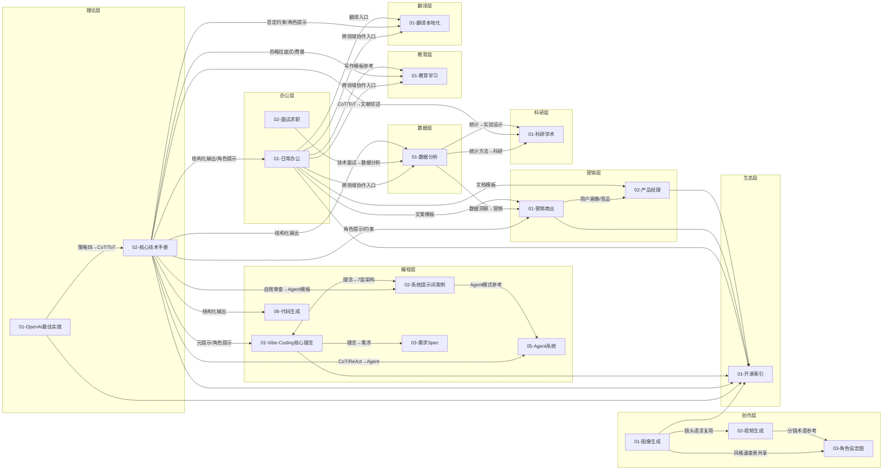
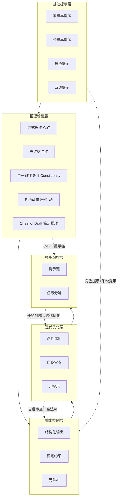
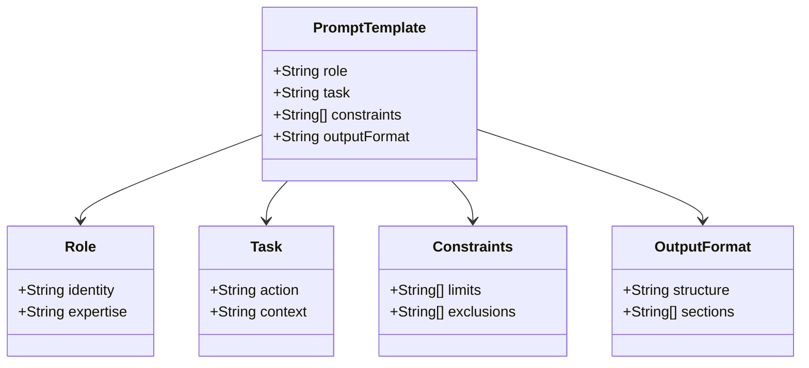
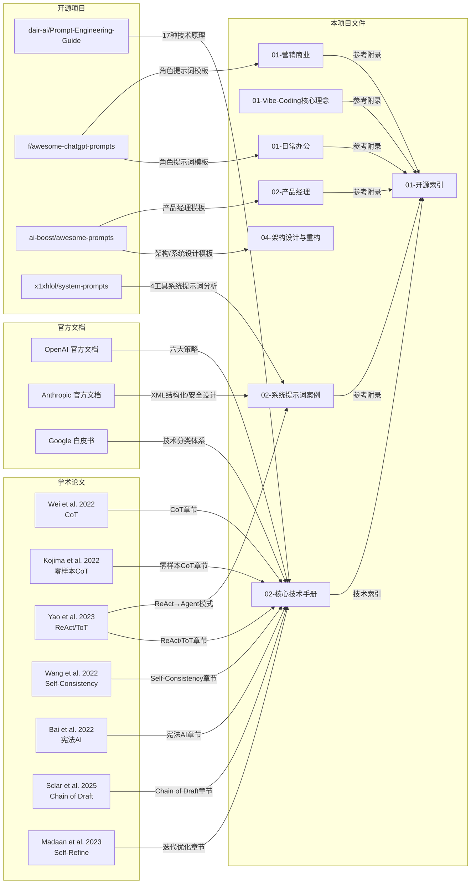

<small style="color:#888">📌 文档导航：[学习路线](01-学习路线.md) | 项目架构 | [需求与路线图](03-需求与路线图.md) | [实施与质量](04-实施与质量.md) | [贡献者指南](05-贡献者指南.md)</small>

# 项目架构与源码导读

## 一、项目定位

本仓库是一个**纯 Markdown 知识库**，不包含任何可执行代码，所有内容以 `.md` 文件组织，面向人类阅读与 AI 辅助使用。

**4个核心价值：

| 价值 | 说明 |
|------|------|
| **系统性** | 从入门理论到17种核心技术，再到9大领域实战案例，形成完整知识体系 |
| **可操作性** | 每个提示词模板均可直接复制使用，含变量占位符和真实输入→输出示例 |
| **溯源可靠** | 内容整合自 OpenAI/Anthropic/Google 官方文档、前沿学术论文及开源社区实践，标注来源 |
| **开放协作** | 基于开源项目整理，持续更新，欢迎社区贡献新案例和优化建议 |

---

## 二、项目目录结构图

```mermaid
flowchart TD
    ROOT["prompt-engineering-case-library/"] --> D01["01-入门与理论/"]
    ROOT --> D02["02-编程开发/"]
    ROOT --> D03["03-AI创作/"]
    ROOT --> D04["04-AI办公写作/"]
    ROOT --> D05["05-AI数据分析/"]
    ROOT --> D06["06-AI教育与学习/"]
    ROOT --> D07["07-AI营销与商业/"]
    ROOT --> D08["08-AI翻译与本地化/"]
    ROOT --> D09["09-AI科研与学术/"]
    ROOT --> D10["10-开源生态/"]

    D01 --> F01A["01-OpenAI提示词最佳实践.md"]
    D01 --> F01B["02-提示词工程核心技术手册.md"]

    D02 --> F02A["01-Vibe-Coding核心理念与工作流.md"]
    D02 --> F02B["02-AI编程助手系统提示词案例.md"]
    D02 --> F02C["03-需求理解与Spec编写提示词.md"]
    D02 --> F02D["04-架构设计与重构提示词.md"]
    D02 --> F02E["05-Agent系统与多智能体编排提示词.md"]
    D02 --> F02F["06-代码生成与实现提示词.md"]
    D02 --> F02G["07-代码审查与质量保障提示词.md"]
    D02 --> F02H["08-调试诊断与Bug修复提示词.md"]
    D02 --> F02I["09-记忆上下文与长文档管理提示词.md"]
    D02 --> F02J["10-前端交互与可视化提示词.md"]
    D02 --> F02K["11-部署运维与DevOps提示词.md"]
    D02 --> F02L["12-项目文档与知识管理提示词.md"]

    D03 --> F03A["01-AI图像生成提示词模板.md"]
    D03 --> F03B["02-AI视频生成提示词模板.md"]
    D03 --> F03C["03-人物图片转三视图提示词.md"]

    D04 --> F04A["01-日常写作与办公提示词模板.md"]
    D04 --> F04B["02-AI面试与求职提示词.md"]

    D05 --> F05A["01-AI数据分析提示词模板.md"]

    D06 --> F06A["01-AI教育与学习提示词模板.md"]

    D07 --> F07A["01-AI营销与商业提示词模板.md"]
    D07 --> F07B["02-AI产品经理提示词.md"]

    D08 --> F08A["01-AI翻译与本地化提示词模板.md"]

    D09 --> F09A["01-AI科研与学术提示词模板.md"]

    D10 --> F10A["01-开源项目与资源索引.md"]
```



---

## 三、文件依赖关系图



---

## 四、技术分层架构图



---

## 五、提示词模板四字段 ER 图



**四字段映射到源文件：

| 字段 | 核心技术手册定义 | 典型使用文件 |
|------|-----------------|-------------|
| **Role** | [核心技术手册](../01-入门与理论/02-提示词工程核心技术手册.md#L619-L626) 附录二：`"10年经验后端工程师，擅长 Python"` | [Vibe Coding 核心理念](../02-编程开发/01-Vibe-Coding核心理念与工作流.md)、[营销商业](../07-AI营销与商业/01-AI营销与商业提示词模板.md#L16-L17) |
| **Task** | [核心技术手册](../01-入门与理论/02-提示词工程核心技术手册.md#L619-L626) 附录二：`"审查代码变更，指出问题并提供建议"` | [数据分析](../05-AI数据分析/01-AI数据分析提示词模板.md#L16-L17)、[科研学术](../09-AI科研与学术/01-AI科研与学术提示词模板.md#L16-L17) |
| **Constraints** | [核心技术手册](../01-入门与理论/02-提示词工程核心技术手册.md#L619-L626) 附录二：`"关注性能和安全，200字以内"` | [面试求职](../04-AI办公写作/02-AI面试与求职提示词.md#L21-L27)、[产品经理](../07-AI营销与商业/02-AI产品经理提示词.md#L57-L62) |
| **OutputFormat** | [核心技术手册](../01-入门与理论/02-提示词工程核心技术手册.md#L619-L626) 附录二：`"问题列表 + 改进建议 + 总体评价"` | [翻译本地化](../08-AI翻译与本地化/01-AI翻译与本地化提示词模板.md#L117-L119)、[教育学习](../06-AI教育与学习/01-AI教育与学习提示词模板.md#L336-L341) |

---

## 六、内容来源追踪图



---

## 七、文件定位与职责

### 7.1 01-入门与理论

#### [01-OpenAI提示词最佳实践.md](../01-入门与理论/01-OpenAI提示词最佳实践.md)

- **定位**：入门第一篇，翻译整理自 OpenAI 官方文档
- **行数**：107 行
- **内容结构树**：
  ```
  OpenAI提示词最佳实践
  ├── 策略一：写出清晰的指令（6个技巧）
  ├── 策略二：提供参考文本（2个技巧）
  ├── 策略三：将复杂任务拆分为简单子任务（3个技巧）
  ├── 策略四：给模型时间"思考"（3个技巧）
  ├── 策略五：使用外部工具（3个技巧）
  ├── 策略六：系统性测试变更（评估方法）
  └── 快速参考卡片
  ```
- **关键交叉引用**：
  - → [核心技术手册](../01-入门与理论/02-提示词工程核心技术手册.md#L5) 导航链接
  - → [Vibe Coding 核心理念](../02-编程开发/01-Vibe-Coding核心理念与工作流.md#L5) 导航链接
  - 策略四"给模型思考时间" → 核心技术手册 CoT/ToT 章节的入口

#### [02-提示词工程核心技术手册.md](../01-入门与理论/02-提示词工程核心技术手册.md)

- **定位**：全仓库核心枢纽，17种提示词技术的原理、模板和效果数据
- **行数**：825 行
- **内容结构树**：
  ```
  提示词工程核心技术手册
  ├── 一、零样本提示
  ├── 二、少样本提示
  ├── 三、链式思维（CoT）
  ├── 四、思维树（ToT）
  ├── 五、自一致性（Self-Consistency）
  ├── 六、ReAct（推理+行动）
  ├── 七、元提示
  ├── 八、角色/人格提示
  ├── 九、提示链
  ├── 十、宪法AI提示
  ├── 十一、结构化输出提示
  ├── 十二、系统提示
  ├── 十三、Chain of Draft
  ├── 十四、否定约束
  ├── 十五、迭代优化
  ├── 十六、自我审查
  ├── 十七、任务分解
  ├── 附录一：Mega-Prompt 综合架构模板
  ├── 附录二：四字段标准结构
  ├── 附录三：多模型适配对比表
  ├── 附录四：模板迭代方法论
  ├── 附录五：领域专用提示词模板
  ├── 附录六：安全提示词
  └── 五大黄金法则
  ```
- **关键交叉引用**：
  - → [OpenAI最佳实践](../01-入门与理论/01-OpenAI提示词最佳实践.md#L5) 导航链接
  - → [Vibe Coding 核心理念](../02-编程开发/01-Vibe-Coding核心理念与工作流.md#L5) 导航链接
  - → [开源索引](../10-开源生态/01-开源项目与资源索引.md#L5) 导航链接
  - CoT 章节（[L85-L126](../01-入门与理论/02-提示词工程核心技术手册.md#L85-L126)）→ Agent系统与多智能体编排 RAG/Agent 开发
  - ReAct 章节（[L219-L248](../01-入门与理论/02-提示词工程核心技术手册.md#L219-L248)）→ 系统提示词案例 Agent 模板
  - 自我审查章节（[L520-L547](../01-入门与理论/02-提示词工程核心技术手册.md#L520-L547)）→ 系统提示词案例安全检查清单
  - 四字段标准结构（[L617-L626](../01-入门与理论/02-提示词工程核心技术手册.md#L617-L626)）→ 全仓库所有模板的字段规范
  - 多模型适配对比表（[L630-L649](../01-入门与理论/02-提示词工程核心技术手册.md#L630-L649)）→ 全仓库模板的模型选择参考

### 7.2 02-编程开发

按 vibe coding 工作流主线组织，共 12 个文件：

#### [01-Vibe-Coding核心理念与工作流.md](../02-编程开发/01-Vibe-Coding核心理念与工作流.md)

- **定位**：vibe coding 理念入门，建立全流程认知
- **核心内容**：7 条提示词，覆盖 Vibe Coding 起源、Spec-Driven Development 四步法、Plan/Spec/Agent 模式对比、Agentic Coder 工作流、反模式避坑、人机协作边界设计
- **关键交叉引用**：
  - → [核心技术手册](../01-入门与理论/02-提示词工程核心技术手册.md) 导航链接
  - → [系统提示词案例](../02-编程开发/02-AI编程助手系统提示词案例.md) 导航链接
  - Spec-Driven Development → 03-需求理解与Spec编写提示词
  - Agent 工作流 → 05-Agent系统与多智能体编排提示词

#### [02-AI编程助手系统提示词案例.md](../02-编程开发/02-AI编程助手系统提示词案例.md)

- **定位**：生产级系统提示词逆向分析，学习顶级设计模式
- **核心内容**：4 大工具分析（Cursor/Windsurf/Claude Code/Devin）+ 3 个通用模板（基础编程助手/Agent模式/代码审查助手）
- **关键交叉引用**：
  - → [核心技术手册](../01-入门与理论/02-提示词工程核心技术手册.md) 导航链接
  - 7层通用架构 ← Agent系统与多智能体编排提示词
  - 安全检查清单模式 ← 核心技术手册自我审查章节
  - 学习资源 → 开源索引系统提示词合集

#### [03-需求理解与Spec编写提示词.md](../02-编程开发/03-需求理解与Spec编写提示词.md)

- **定位**：vibe coding 流程起点，将模糊需求转化为可执行规格
- **核心内容**：9 条提示词，覆盖意图描述模板、需求拆解为文档、Spec 文档结构设计、BDD 用户故事、MoSCoW 优先级、技术方案制定、需求边界分析、需求评审、需求变更管理

#### [04-架构设计与重构提示词.md](../02-编程开发/04-架构设计与重构提示词.md)

- **定位**：架构层面的设计、重构与对齐
- **核心内容**：12 条提示词，覆盖架构模式重构、状态管理、上下文管理、流式工具执行、生命周期Hook、消息队列、流水线解耦、参考框架对比、系统设计六步法、数据库Schema设计、代码重构、技术债务审计

#### [05-Agent系统与多智能体编排提示词.md](../02-编程开发/05-Agent系统与多智能体编排提示词.md)

- **定位**：AI Agent 系统设计与多智能体协作
- **核心内容**：18 条提示词，覆盖分层多智能体、Agent隔离、流水线解耦、节点Loop、蓝图涌现、工具延迟加载、工具集对齐、生命周期标准化、Swarm集群、跨进程协作、RAG应用开发、AI Agent开发、提示词优化、Agent系统提示词设计、工作流编排、安全防护、Agentic Coder、Multi-Agent协调器

#### [06-代码生成与实现提示词.md](../02-编程开发/06-代码生成与实现提示词.md)

- **定位**：从 Spec 到代码的实现流程与最佳实践
- **核心内容**：8 条提示词，覆盖 Spec→Code 实现流程、代码生成最佳实践、API 集成架构、性能优化、代码规范与风格统一、增量开发与版本控制、代码生成后自检清单、多语言/多框架适配

#### [07-代码审查与质量保障提示词.md](../02-编程开发/07-代码审查与质量保障提示词.md)

- **定位**：代码审查、测试策略与质量保障
- **核心内容**：17 条提示词，覆盖测试策略制定、单元/集成测试编写、测试用例设计、深度代码审查、代码重构、性能优化、Code Review、标准化测试流程、回归测试、系统测试、前后端联调、Bug深度修复、ISO25010质量特性测试、Agent Eval、Token消耗监控、测试报告与文档同步

#### [08-调试诊断与Bug修复提示词.md](../02-编程开发/08-调试诊断与Bug修复提示词.md)

- **定位**：科学诊断流程与 Bug 修复
- **核心内容**：8 条提示词，覆盖科学诊断流程、错误分析与定位、Bug追踪与修复、异常处理完善、性能问题诊断、生产环境故障排查、防复发措施、日志分析与链路追踪

#### [09-记忆上下文与长文档管理提示词.md](../02-编程开发/09-记忆上下文与长文档管理提示词.md)

- **定位**：记忆引擎、上下文压缩与长文档管理
- **核心内容**：9 条提示词，覆盖记忆引擎架构设计、LLM Wiki 架构选型、短期/长期记忆解耦、注意力预算管理、一致性规则引擎、双源可靠设计、记忆引擎持续优化、知识库与Wiki合并重构、多任务隔离

#### [10-前端交互与可视化提示词.md](../02-编程开发/10-前端交互与可视化提示词.md)

- **定位**：前端重构、交互优化与可视化
- **核心内容**：8 条提示词，覆盖前端重构设计、实时进度与Trace展示、半自动模式交互、前后端数据流校验、端口管理优化、表单交互优化、文件展示与持久化、全模块Web测试

#### [11-部署运维与DevOps提示词.md](../02-编程开发/11-部署运维与DevOps提示词.md)

- **定位**：部署运维与 DevOps 实践
- **核心内容**：6 条提示词，覆盖部署配置（Docker容器化）、CI/CD流水线、Kubernetes部署、可观测性体系、生产环境运维、蓝绿部署与灰度发布

#### [12-项目文档与知识管理提示词.md](../02-编程开发/12-项目文档与知识管理提示词.md)

- **定位**：项目文档体系建设与知识管理
- **核心内容**：17 条提示词，覆盖项目结构阅读、文档体系建设、文档分类归档、README优化、需求文档拆解、文档正确性校验、长上下文压缩、文档修改优先级规则、源码学习与逆向分析、专项技术学习、源码分析拆解、构建技术栈清单、技术栈持续优化、学习文档深度优化、开发复盘、持续优化

### 7.3 03-AI创作

#### [01-AI图像生成提示词模板.md](../03-AI创作/01-AI图像生成提示词模板.md)

- **定位**：AI 绘画结构化提示词体系，覆盖万能公式、风格控制、镜头语言
- **行数**：314 行
- **内容结构树**：
  ```
  AI图像生成提示词模板
  ├── 一、万能公式（5要素）
  ├── 二、提示词结构化模板（4种：通用详细/通用简洁/人像/场景）
  ├── 三、风格控制参考
  │   ├── 3.1 艺术风格关键词（10种）
  │   ├── 3.2 渲染引擎关键词（6种）
  │   └── 3.3 色彩调性关键词（9种）
  ├── 四、镜头语言参考
  │   ├── 4.1 景别（7种）
  │   ├── 4.2 视角（5种）
  │   ├── 4.3 光线（7种）
  │   └── 4.4 镜头与景深（6种）
  ├── 五、负面提示词参考（4类）
  ├── 六、高级技巧（5项）
  ├── 七、实战案例：逐步构建
  ├── 八、工具特定提示（3种工具）
  └── 九、常见问题 FAQ
  ```
- **关键交叉引用**：
  - → [核心技术手册](../01-入门与理论/02-提示词工程核心技术手册.md#L5) 导航链接
  - → [视频生成](../03-AI创作/02-AI视频生成提示词模板.md#L5) 导航链接
  - → [角色设定图](../03-AI创作/03-人物图片转三视图提示词.md#L5) 导航链接
  - 风格关键词（[L78-L91](../03-AI创作/01-AI图像生成提示词模板.md#L78-L91)）→ 角色设定图风格速查表共享

#### [02-AI视频生成提示词模板.md](../03-AI创作/02-AI视频生成提示词模板.md)

- **定位**：AI 视频生成结构化提示词，含完整案例和6种可复用模板
- **行数**：282 行
- **内容结构树**：
  ```
  AI视频生成提示词模板
  ├── 一、提示词结构框架（5模块）
  ├── 二、完整案例：史诗级太空坠落
  ├── 三、可复用模板（6种：通用/简洁/角色动态/产品展示/自然风景/Logo动画/场景转场）
  ├── 四、分镜头运镜术语参考（14种运镜）
  ├── 五、使用技巧（8条）
  └── 六、常见问题（7个Q&A）
  ```
- **关键交叉引用**：
  - → [核心技术手册](../01-入门与理论/02-提示词工程核心技术手册.md#L5) 导航链接
  - → [图像生成](../03-AI创作/01-AI图像生成提示词模板.md#L5) 导航链接
  - → [角色设定图](../03-AI创作/03-人物图片转三视图提示词.md#L5) 导航链接
  - 运镜术语（[L229-L246](../03-AI创作/02-AI视频生成提示词模板.md#L229-L246)）← 图像生成镜头语言参考

#### [03-人物图片转三视图提示词.md](../03-AI创作/03-人物图片转三视图提示词.md)

- **定位**：角色设定图专用模板，含三视图/多角度/表情/服装/配件/视频迁移
- **行数**：161 行
- **内容结构树**：
  ```
  角色设定图提示词模板
  ├── 一、通用三视图模板
  ├── 二、带参考图的三视图
  ├── 三、多角度视图模板
  ├── 四、表情设定图模板
  ├── 五、服装细节设定图模板
  ├── 六、配件道具设定图模板
  ├── 七、视频人物迁移（设定图辅助）
  ├── 八、风格速查表（11种风格）
  ├── 九、使用技巧（8条）
  └── 十、常见问题（6个Q&A）
  ```
- **关键交叉引用**：
  - → [核心技术手册](../01-入门与理论/02-提示词工程核心技术手册.md#L5) 导航链接
  - → [图像生成](../03-AI创作/01-AI图像生成提示词模板.md#L5) 导航链接
  - → [视频生成](../03-AI创作/02-AI视频生成提示词模板.md#L5) 导航链接
  - 风格速查表（[L112-L126](../03-AI创作/03-人物图片转三视图提示词.md#L112-L126)）← 图像生成风格关键词共享

### 7.4 04-AI办公写作

#### [01-日常写作与办公提示词模板.md](../04-AI办公写作/01-日常写作与办公提示词模板.md)

- **定位**：日常办公高频场景提示词模板，含跨领域协作入口
- **行数**：319 行
- **内容结构树**：
  ```
  日常写作与办公提示词模板
  ├── 一、周报生成
  ├── 二、会议纪要整理
  ├── 三、邮件撰写（2种：商务/项目汇报）
  ├── 四、公文写作
  ├── 五、对比分析
  ├── 六、内容创作（3种：公众号/小红书/短视频）
  ├── 七、跨领域协作提示词（6个快速入口）
  ├── 八、AI模型选择建议
  └── 九、常见问题 FAQ
  ```
- **关键交叉引用**：
  - → [核心技术手册](../01-入门与理论/02-提示词工程核心技术手册.md#L5) 导航链接
  - → [数据分析](../05-AI数据分析/01-AI数据分析提示词模板.md#L5) 导航链接
  - → [翻译本地化](../08-AI翻译与本地化/01-AI翻译与本地化提示词模板.md#L5) 导航链接
  - 跨领域协作入口（[L268-L278](../04-AI办公写作/01-日常写作与办公提示词模板.md#L268-L278)）→ 翻译/教育/数据分析

#### [02-AI面试与求职提示词.md](../04-AI办公写作/02-AI面试与求职提示词.md)

- **定位**：求职全流程提示词，覆盖简历→面试→薪资谈判→个人品牌
- **行数**：364 行
- **内容结构树**：
  ```
  AI面试与求职提示词
  ├── 一、简历优化
  ├── 二、面试模拟
  ├── 三、行为面试准备（STAR法则）
  ├── 四、技术面试准备
  ├── 五、职业规划
  ├── 六、薪资谈判
  ├── 七、求职信/自荐信
  └── 八、LinkedIn/个人品牌
  ```
- **关键交叉引用**：
  - → [核心技术手册](../01-入门与理论/02-提示词工程核心技术手册.md#L5) 导航链接
  - → [日常办公](../04-AI办公写作/01-日常写作与办公提示词模板.md#L5) 导航链接
  - → [数据分析](../05-AI数据分析/01-AI数据分析提示词模板.md#L5) 导航链接

### 7.5 05-AI数据分析

#### [01-AI数据分析提示词模板.md](../05-AI数据分析/01-AI数据分析提示词模板.md)

- **定位**：数据分析全流程提示词，从 SQL 生成到数据看板设计
- **行数**：644 行
- **内容结构树**：
  ```
  AI数据分析提示词模板
  ├── 一、SQL 查询生成
  ├── 二、数据解读与洞察提取
  ├── 三、统计分析与假设检验
  ├── 四、数据可视化建议
  ├── 五、数据清洗与预处理
  ├── 六、自动化报告生成
  ├── 七、A/B 测试分析
  ├── 八、预测建模建议
  ├── 九、使用技巧
  ├── 十、常见问题 FAQ
  ├── 十一、特征工程
  ├── 十二、数据清洗流水线
  └── 十三、数据看板设计
  ```
- **关键交叉引用**：
  - → [核心技术手册](../01-入门与理论/02-提示词工程核心技术手册.md#L5) 导航链接
  - → [办公写作](../04-AI办公写作/01-日常写作与办公提示词模板.md#L5) 导航链接
  - → [科研学术](../09-AI科研与学术/01-AI科研与学术提示词模板.md#L5) 导航链接
  - A/B 测试分析（[L358-L393](../05-AI数据分析/01-AI数据分析提示词模板.md#L358-L393)）→ 产品经理 A/B 测试设计
  - 统计分析（[L154-L201](../05-AI数据分析/01-AI数据分析提示词模板.md#L154-L201)）→ 科研学术实验设计

### 7.6 06-AI教育与学习

#### [01-AI教育与学习提示词模板.md](../06-AI教育与学习/01-AI教育与学习提示词模板.md)

- **定位**：教育学习场景提示词，含苏格拉底式教学和费曼学习法
- **行数**：557 行
- **内容结构树**：
  ```
  AI教育与学习提示词模板
  ├── 一、概念讲解（苏格拉底式教学）
  ├── 二、个性化学习路径设计
  ├── 三、考试备考辅导（2种：备考策略/练习题生成）
  ├── 四、语言学习辅助（2种：情景对话/词汇深度学习）
  ├── 五、课程与教案设计
  ├── 六、写作与思维训练（2种：批判性思维/学术论文写作）
  ├── 七、知识卡片与记忆辅助
  ├── 八、使用技巧
  ├── 九、常见问题 FAQ
  ├── 十、费曼学习法
  ├── 十一、间隔重复计划
  └── 十二、知识图谱构建
  ```
- **关键交叉引用**：
  - → [核心技术手册](../01-入门与理论/02-提示词工程核心技术手册.md#L5) 导航链接
  - → [办公写作](../04-AI办公写作/01-日常写作与办公提示词模板.md#L5) 导航链接
  - 学术论文写作辅导（[L286-L306](../06-AI教育与学习/01-AI教育与学习提示词模板.md#L286-L306)）→ 科研学术论文写作辅助

### 7.7 07-AI营销与商业

#### [01-AI营销与商业提示词模板.md](../07-AI营销与商业/01-AI营销与商业提示词模板.md)

- **定位**：营销与商业场景提示词，覆盖品牌策划到危机公关
- **行数**：385 行
- **内容结构树**：
  ```
  AI营销与商业提示词模板
  ├── 一、品牌定位与策划
  ├── 二、广告文案撰写（2种：社交媒体/短视频脚本）
  ├── 三、SEO 与内容营销（2种：关键词策略/SEO优化文章）
  ├── 四、竞品分析
  ├── 五、商业计划与策略（2种：商业计划大纲/增长策略）
  ├── 六、用户调研与洞察（2种：用户访谈/用户画像）
  ├── 七、社交媒体运营（2种：内容日历/危机公关）
  ├── 八、使用技巧
  └── 九、常见问题 FAQ
  ```
- **关键交叉引用**：
  - → [核心技术手册](../01-入门与理论/02-提示词工程核心技术手册.md#L5) 导航链接
  - → [数据分析](../05-AI数据分析/01-AI数据分析提示词模板.md#L5) 导航链接
  - → [办公写作](../04-AI办公写作/01-日常写作与办公提示词模板.md#L5) 导航链接
  - 竞品分析（[L167-L202](../07-AI营销与商业/01-AI营销与商业提示词模板.md#L167-L202)）→ 产品经理竞品分析
  - 用户画像（[L291-L312](../07-AI营销与商业/01-AI营销与商业提示词模板.md#L291-L312)）→ 产品经理用户画像

#### [02-AI产品经理提示词.md](../07-AI营销与商业/02-AI产品经理提示词.md)

- **定位**：产品经理专业提示词，覆盖 PRD 到复盘全流程
- **行数**：567 行
- **内容结构树**：
  ```
  AI产品经理提示词
  ├── 一、需求文档撰写（PRD）
  ├── 二、竞品分析
  ├── 三、用户画像
  ├── 四、用户访谈大纲
  ├── 五、产品路线图规划
  ├── 六、数据指标体系
  ├── 七、A/B 测试设计
  └── 八、产品复盘
  ```
- **关键交叉引用**：
  - → [核心技术手册](../01-入门与理论/02-提示词工程核心技术手册.md#L5) 导航链接
  - → [营销商业](../07-AI营销与商业/01-AI营销与商业提示词模板.md#L5) 导航链接
  - → [办公写作](../04-AI办公写作/01-日常写作与办公提示词模板.md#L5) 导航链接
  - A/B 测试设计（[L426-L501](../07-AI营销与商业/02-AI产品经理提示词.md#L426-L501)）→ 数据分析 A/B 测试分析
  - 数据指标体系（[L354-L423](../07-AI营销与商业/02-AI产品经理提示词.md#L354-L423)）→ 数据分析数据看板设计

### 7.8 08-AI翻译与本地化

#### [01-AI翻译与本地化提示词模板.md](../08-AI翻译与本地化/01-AI翻译与本地化提示词模板.md)

- **定位**：翻译与本地化全场景提示词，含创译和术语库管理
- **行数**：524 行
- **内容结构树**：
  ```
  AI翻译与本地化提示词模板
  ├── 一、专业领域翻译
  ├── 二、技术文档本地化
  ├── 三、游戏/App 本地化（2种：游戏剧情/UI文本）
  ├── 四、文化适配与创译（2种：创译/品牌名称本地化）
  ├── 五、翻译质量评估
  ├── 六、多语言批量翻译
  ├── 七、字幕翻译
  ├── 八、使用技巧
  ├── 九、常见问题 FAQ
  ├── 十、同声传译辅助
  ├── 十一、术语库管理
  └── 十二、多语言 SEO 本地化
  ```
- **关键交叉引用**：
  - → [核心技术手册](../01-入门与理论/02-提示词工程核心技术手册.md#L5) 导航链接
  - → [办公写作](../04-AI办公写作/01-日常写作与办公提示词模板.md#L5) 导航链接
  - 多语言 SEO 本地化（[L458-L524](../08-AI翻译与本地化/01-AI翻译与本地化提示词模板.md#L458-L524)）→ 营销商业 SEO 内容营销

### 7.9 09-AI科研与学术

#### [01-AI科研与学术提示词模板.md](../09-AI科研与学术/01-AI科研与学术提示词模板.md)

- **定位**：科研学术全流程提示词，从文献综述到实验记录
- **行数**：604 行
- **内容结构树**：
  ```
  AI科研与学术提示词模板
  ├── 一、文献综述辅助
  ├── 二、研究问题与假设设计
  ├── 三、研究方法设计（2种：实验设计/问卷设计）
  ├── 四、论文写作辅助（2种：论文结构大纲/学术语言润色）
  ├── 五、论文审稿与修改（2种：模拟审稿/审稿意见回应）
  ├── 六、学术汇报与演示（2种：会议报告/学术海报）
  ├── 七、使用技巧
  ├── 八、常见问题 FAQ
  ├── 九、Nature 风格论文写作
  ├── 十、实验记录规范化
  └── 十一、学术海报设计
  ```
- **关键交叉引用**：
  - → [核心技术手册](../01-入门与理论/02-提示词工程核心技术手册.md#L5) 导航链接
  - → [数据分析](../05-AI数据分析/01-AI数据分析提示词模板.md#L5) 导航链接
  - 文献综述（[L9-L68](../09-AI科研与学术/01-AI科研与学术提示词模板.md#L9-L68)）→ 核心技术手册 CoT/ToT 论文引用
  - 实验设计（[L111-L168](../09-AI科研与学术/01-AI科研与学术提示词模板.md#L111-L168)）→ 数据分析统计分析

### 7.10 10-开源生态

#### [01-开源项目与资源索引.md](../10-开源生态/01-开源项目与资源索引.md)

- **定位**：开源项目与学习资源汇总，全仓库的参考附录
- **行数**：221 行
- **内容结构树**：
  ```
  开源项目与资源索引
  ├── 一、核心开源项目
  │   ├── 1.1 综合资源库（7个项目）
  │   ├── 1.2 系统提示词泄露与学习仓库（5个仓库）
  │   └── 1.3 图像生成提示词（2个项目）
  ├── 二、提示词工程框架与工具
  │   ├── 2.1 提示词编程框架（2个）
  │   ├── 2.2 自动提示词优化（4个）
  │   ├── 2.3 评估与测试（2个）
  │   ├── 2.4 安全与红队测试（3个）
  │   └── 2.5 低代码/工作流平台（2个）
  ├── 三、官方最佳实践文档（4个来源）
  ├── 四、核心学术论文
  │   ├── 4.1 基础技术（6篇）
  │   ├── 4.2 自动优化与自我改进（4篇）
  │   ├── 4.3 RAG与知识（3篇）
  │   ├── 4.4 Agent可靠性与安全（4篇）
  │   └── 4.5 综述与模式（3篇）
  ├── 五、Agent 生态与协议
  ├── 六、在线学习资源（6个）
  ├── 七、提示词技术速查（17种技术）
  └── 八、2025-2026 三大趋势
  ```
- **关键交叉引用**：
  - → [核心技术手册](../01-入门与理论/02-提示词工程核心技术手册.md#L6) 导航链接
  - → [OpenAI最佳实践](../01-入门与理论/01-OpenAI提示词最佳实践.md#L211) 技术速查底部链接
  - 所有文件 → 开源索引（参考附录）

---

## 八、文件间交叉引用关系矩阵

> 注：02-编程开发目录已重构为 12 个文件，统一作为"02-编程开发（vibe coding 全流程）"列呈现，内部 12 文件之间互相导航链接。

| 源文件 | OpenAI最佳实践 | 核心技术手册 | 02-编程开发（12文件） | 图像生成 | 视频生成 | 角色设定图 | 日常办公 | 面试求职 | 数据分析 | 教育学习 | 营销商业 | 产品经理 | 翻译本地化 | 科研学术 | 开源索引 |
|--------|:---:|:---:|:---:|:---:|:---:|:---:|:---:|:---:|:---:|:---:|:---:|:---:|:---:|:---:|:---:|
| OpenAI最佳实践 | - | ✦ | ○ | | | | | | | | | | | | |
| 核心技术手册 | ○ | - | ✦ | ○ | ○ | ○ | ○ | ○ | ○ | ○ | ○ | ○ | ○ | ○ | ✦ |
| 02-编程开发（12文件） | | ○ | - | | | | | | | | | | | | ○ |
| 图像生成 | | ○ | | - | ○ | ✦ | | | | | | | | | |
| 视频生成 | | ○ | | ○ | - | ○ | | | | | | | | | |
| 角色设定图 | | ○ | | ○ | ○ | - | | | | | | | | | |
| 日常办公 | | ○ | | | | | - | ○ | ○ | ○ | ○ | | ○ | | |
| 面试求职 | | ○ | | | | | ○ | - | ○ | | | | | | |
| 数据分析 | | ○ | | | | | ○ | | - | | | | | ○ | |
| 教育学习 | | ○ | | | | | ○ | | | - | | | | | |
| 营销商业 | | ○ | | | | | ○ | | ○ | | - | ○ | | | |
| 产品经理 | | ○ | | | | | ○ | | | | ○ | - | | | |
| 翻译本地化 | | ○ | | | | | ○ | | | | | | - | | |
| 科研学术 | | ○ | | | | | | | ○ | | | | | - | |
| 开源索引 | | ○ | ○ | ○ | | | ○ | | | | ○ | ○ | | | - |

图例：✦ = 强引用（内容级依赖） ○ = 弱引用（导航链接） 空白 = 无直接引用

---

## 九、内容规范

### 9.1 提示词标识与格式

| 元素 | 格式 | 示例 |
|------|------|------|
| 提示词标识 | `<small style="color:#888">提示词：</small>` | 缩小变灰，放在提示词内容上方 |
| 提示词内容 | `**加粗**` | 正常字号，视觉突出 |
| 说明文字 | `<small style="color:#888">...</small>` | 适用场景、填写说明等，缩小变灰 |
| 分隔 | `---` | 各模板之间 |
| 变量 | `{变量名}` | `{目标岗位}`、`{数据描述}` |

### 9.2 文件结构规范

```
# 文件标题

<small style="color:#888">文件级说明</small>

<small style="color:#888">📌 导航：[README](../README.md) | [上游文件](...) | 你在这里 | [下游文件](...)</small>

---

## 一、章节标题

适用场景：场景描述

<small style="color:#888">提示词：</small>

**提示词正文（加粗）**

**约束：**
- 约束条件

**输出格式：**
## 输出章节

---

## 二、章节标题
...
```

### 9.3 导航链接规范

每个文件开头包含导航栏，格式为：

```
<small style="color:#888">📌 导航：[README](../README.md) | [上游](...) | 你在这里 | [下游](...)</small>
```

导航链接遵循以下规则：
- 第一个链接始终指向 README
- 中间链接指向上游依赖文件
- 你在这里 标记当前文件
- 后续链接指向下游或同级文件

---

## 十、维护要点

### 10.1 修改影响分析

| 修改目标 | 影响范围 | 影响程度 | 说明 |
|---------|---------|---------|------|
| 核心技术手册 | 全仓库17个文件 | 🔴 高 | 所有文件的导航链接和技术引用均指向此文件 |
| OpenAI最佳实践 | 核心技术手册、Vibe Coding 核心理念、开源索引 | 🟡 中 | 入口文件，策略变更影响下游技术章节 |
| Vibe Coding 核心理念 | 02-编程开发其他11个文件、系统提示词案例、开源索引 | 🟡 中 | vibe coding 工作流主线入口，与系统提示词案例双向引用 |
| 系统提示词案例 | Vibe Coding 核心理念、Agent系统与多智能体编排 | 🟡 中 | 7层架构被 Agent 系统文件引用 |
| 图像生成 | 视频生成、角色设定图 | 🟡 中 | 风格速查表和镜头语言被两个下游文件复用 |
| 日常办公 | 面试求职、数据分析、教育学习、翻译本地化 | 🟡 中 | 跨领域协作入口链接到4个文件 |
| 开源索引 | 全仓库 | 🟢 低 | 仅作为参考附录，修改不影响其他文件内容 |
| 其他领域文件 | 同目录或关联领域文件 | 🟢 低 | 引用关系较少，修改影响有限 |

### 10.2 修改优先级

| 优先级 | 场景 | 操作 |
|--------|------|------|
| P0 | 核心技术手册新增/修改技术 | 同步更新：开源索引技术速查表、受影响领域文件的导航链接 |
| P1 | Vibe Coding 核心理念修改 | 同步更新：02-编程开发其他11个文件的导航链接、系统提示词案例交叉引用 |
| P1 | 图像生成风格关键词修改 | 同步更新：角色设定图风格速查表 |
| P2 | 新增领域文件 | 更新：README 目录、开源索引参考附录、日常办公跨领域协作入口 |
| P3 | 日常办公跨领域入口修改 | 检查：链接目标文件是否仍然有效 |
| P3 | 导航链接修改 | 全仓库搜索旧链接路径，批量替换 |

---

## 十一、与开源项目的对应关系

| 本项目文件 | 对应开源项目/论文 | 对应内容 |
|-----------|-----------------|---------|
| [01-OpenAI最佳实践](../01-入门与理论/01-OpenAI提示词最佳实践.md) | OpenAI 官方文档 *Best practices for prompt engineering with the OpenAI API* | 六大策略及具体技巧 |
| [02-核心技术手册](../01-入门与理论/02-提示词工程核心技术手册.md) | [dair-ai/Prompt-Engineering-Guide](https://github.com/dair-ai/Prompt-Engineering-Guide) | 17种核心提示词技术原理 |
| [02-核心技术手册](../01-入门与理论/02-提示词工程核心技术手册.md) | Wei et al. 2022, *Chain-of-Thought Prompting* | CoT 章节及效果数据 |
| [02-核心技术手册](../01-入门与理论/02-提示词工程核心技术手册.md) | Kojima et al. 2022, *Large Language Models are Zero-Shot Reasoners* | 零样本 CoT 章节 |
| [02-核心技术手册](../01-入门与理论/02-提示词工程核心技术手册.md) | Yao et al. 2023, *Tree of Thoughts* / Yao et al. 2022, *ReAct* | ToT 和 ReAct 章节 |
| [02-核心技术手册](../01-入门与理论/02-提示词工程核心技术手册.md) | Wang et al. 2022, *Self-Consistency* | 自一致性章节及效果数据 |
| [02-核心技术手册](../01-入门与理论/02-提示词工程核心技术手册.md) | Bai et al. 2022, *Constitutional AI* | 宪法AI章节 |
| [02-核心技术手册](../01-入门与理论/02-提示词工程核心技术手册.md) | Sclar et al. 2025, *Chain of Draft* | Chain of Draft 章节 |
| [02-核心技术手册](../01-入门与理论/02-提示词工程核心技术手册.md) | Madaan et al. 2023, *Self-Refine* | 迭代优化章节 |
| [02-核心技术手册](../01-入门与理论/02-提示词工程核心技术手册.md) | Anthropic 官方文档 | XML 结构化、Claude 适配建议 |
| [02-核心技术手册](../01-入门与理论/02-提示词工程核心技术手册.md) | Google *Prompt Engineering Whitepaper* | 技术分类体系 |
| [01-Vibe-Coding核心理念与工作流](../02-编程开发/01-Vibe-Coding核心理念与工作流.md) | Andrej Karpathy 2025 Vibe Coding 概念、Anthropic 官方指南 | Vibe Coding 理念与 Spec-Driven Development 方法论 |
| [02-系统提示词案例](../02-编程开发/02-AI编程助手系统提示词案例.md) | [x1xhlol/system-prompts-and-models-of-ai-tools](https://github.com/x1xhlol/system-prompts-and-models-of-ai-tools) | Cursor/Windsurf/Claude Code/Devin 4工具分析 |
| [03-需求理解与Spec编写](../02-编程开发/03-需求理解与Spec编写提示词.md) | Anthropic 官方指南、社区实践整理 | Spec-Driven Development 提示词模板 |
| [04-架构设计与重构](../02-编程开发/04-架构设计与重构提示词.md) | [ai-boost/awesome-prompts](https://github.com/ai-boost/awesome-prompts)、Anthropic 官方指南 | 系统设计/架构重构/技术债务模板 |
| [05-Agent系统与多智能体编排](../02-编程开发/05-Agent系统与多智能体编排提示词.md) | 社区实践整理、Anthropic 官方指南 | 多智能体架构/工作流编排模板 |
| [06-代码生成与实现](../02-编程开发/06-代码生成与实现提示词.md) | 社区实践整理 | Spec→Code/API集成/性能优化模板 |
| [07-代码审查与质量保障](../02-编程开发/07-代码审查与质量保障提示词.md) | [ai-boost/awesome-prompts](https://github.com/ai-boost/awesome-prompts)、ISO25010 标准 | 测试策略/代码审查/质量保障模板 |
| [08-调试诊断与Bug修复](../02-编程开发/08-调试诊断与Bug修复提示词.md) | 社区实践整理 | 科学诊断/Bug修复模板 |
| [09-记忆上下文与长文档管理](../02-编程开发/09-记忆上下文与长文档管理提示词.md) | 社区实践整理 | 记忆引擎/LLM Wiki/上下文压缩模板 |
| [10-前端交互与可视化](../02-编程开发/10-前端交互与可视化提示词.md) | 社区实践整理 | 前端重构/Trace可视化模板 |
| [11-部署运维与DevOps](../02-编程开发/11-部署运维与DevOps提示词.md) | 社区实践整理 | Docker/K8s/CI-CD/可观测性模板 |
| [12-项目文档与知识管理](../02-编程开发/12-项目文档与知识管理提示词.md) | 社区实践整理 | 项目理解/源码学习/技术栈管理模板 |
| [01-日常办公](../04-AI办公写作/01-日常写作与办公提示词模板.md) | [f/awesome-chatgpt-prompts](https://github.com/f/awesome-chatgpt-prompts) | 角色提示词模板 |
| [01-营销商业](../07-AI营销与商业/01-AI营销与商业提示词模板.md) | [f/awesome-chatgpt-prompts](https://github.com/f/awesome-chatgpt-prompts) | 营销文案角色模板 |
| [02-产品经理](../07-AI营销与商业/02-AI产品经理提示词.md) | [ai-boost/awesome-prompts](https://github.com/ai-boost/awesome-prompts) | 产品经理专业模板 |
| [01-开源索引](../10-开源生态/01-开源项目与资源索引.md) | 多个开源项目 | 项目/论文/工具汇总索引 |
