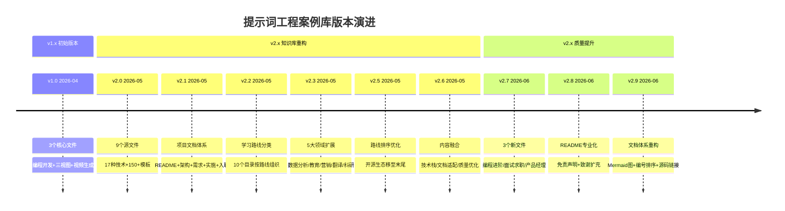
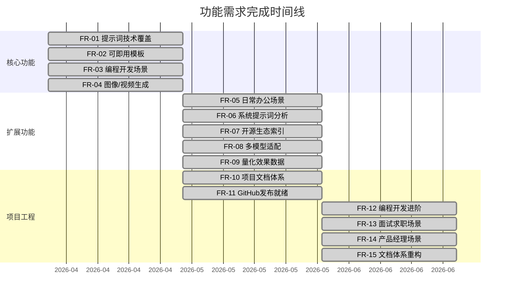

<small style="color:#888">📌 文档导航：[学习路线](01-学习路线.md) | [项目架构](02-项目架构.md) | 需求与路线图 | [实施与质量](04-实施与质量.md) | [贡献者指南](05-贡献者指南.md)</small>

# 需求文档与路线图

统合提示词工程案例库的需求定义、里程碑记录和未来规划。

---

## 一、项目愿景

构建中文互联网最系统、最实用、最可即用的提示词工程知识库，让任何人都能：

1. **10分钟上手**：通过 OpenAI 最佳实践快速入门
2. **30分钟精通**：通过核心技术手册掌握17种技术
3. **即查即用**：根据场景直接复制模板使用
4. **深度学习**：通过开源项目索引进入生态

---

## 二、核心需求定义

### 2.1 功能需求

| ID | 需求 | 优先级 | 状态 | 对应文件 |
|----|------|--------|------|---------|
| FR-01 | 覆盖主流提示词技术（≥15种） | P0 | ✅ | 核心技术手册.md |
| FR-02 | 每种技术提供可即用模板 | P0 | ✅ | 核心技术手册.md |
| FR-03 | 编程开发场景完整覆盖 | P0 | ✅ | 编程开发提示词案例.md |
| FR-04 | AI图像/视频生成提示词体系 | P0 | ✅ | AI图像/视频生成提示词模板.md |
| FR-05 | 日常办公场景提示词 | P1 | ✅ | 日常写作与办公提示词模板.md |
| FR-06 | 生产级系统提示词分析 | P1 | ✅ | AI编程助手系统提示词案例.md |
| FR-07 | 开源生态索引与关联 | P1 | ✅ | 开源项目与资源索引.md |
| FR-08 | 多模型适配指南 | P1 | ✅ | 核心技术手册.md 附录三 |
| FR-09 | 量化效果数据 | P2 | ✅ | 核心技术手册.md 各章节 |
| FR-10 | 项目文档体系 | P1 | ✅ | docs/ |
| FR-11 | GitHub 发布就绪 | P1 | ✅ | README/LICENSE/CONTRIBUTING |
| FR-12 | 编程开发进阶场景覆盖 | P1 | ✅ | 03-需求理解与Spec编写提示词.md |
| FR-13 | 面试求职场景覆盖 | P1 | ✅ | 02-AI面试与求职提示词.md |
| FR-14 | 产品经理场景覆盖 | P1 | ✅ | 02-AI产品经理提示词.md |
| FR-15 | 文档体系重构 | P1 | ✅ | docs/ |

### 2.2 非功能需求

| ID | 需求 | 目标 | 当前状态 |
|----|------|------|---------|
| NFR-01 | 中文友好 | 100% 中文内容 | ✅ |
| NFR-02 | 可复制性 | 所有模板可直接复制 | ✅ |
| NFR-03 | 时效性 | 6个月内更新一次 | ✅ |
| NFR-04 | 可导航性 | README+交叉引用+导航栏 | ✅ |
| NFR-05 | 社区可贡献 | CONTRIBUTING+PR流程 | ✅ |

---

## 三、版本演进时间线

---

## 四、里程碑记录

### Milestone 1：初始版本 (v1.0) — 2026年4月

**目标**：搭建基础框架，覆盖核心场景

| 交付物 | 状态 |
|--------|------|
| 编程开发提示词案例.md（7大类14条） | ✅ |
| 人物图片转三视图提示词.md（3个模板） | ✅ |
| AI视频生成提示词模板.md（3个模板+1案例） | ✅ |
| docs/提示词案例库优化需求文档.md | ✅ |

**已知问题**：
- 编程开发方向覆盖不足，缺少7个核心场景
- 图像生成仅覆盖三视图
- 视频生成类型偏少

### Milestone 2：知识库重构 (v2.0) — 2026年5月

**目标**：大幅扩充内容，建立完整知识体系

| 交付物 | 状态 |
|--------|------|
| 提示词工程核心技术手册.md（17种技术+6附录） | ✅ |
| OpenAI提示词最佳实践.md（6大策略） | ✅ |
| AI图像生成提示词模板.md（万能公式+完整体系） | ✅ |
| 日常写作与办公提示词模板.md（10种场景） | ✅ |
| AI编程助手系统提示词案例.md（4工具分析+3模板） | ✅ |
| 开源项目与资源索引.md（8大分类50+项目） | ✅ |
| 编程开发提示词案例.md（扩充至14类+Agent） | ✅ |
| 人物图片转三视图提示词.md（扩充至8模板+风格表） | ✅ |
| AI视频生成提示词模板.md（扩充至7模板+术语表） | ✅ |

**改进**：
- 从3个文件扩展到9个源文件
- 新增6个文件，3个文件大幅扩充
- 提示词总数从 ~20条 扩展到 150+ 条
- 新增17种核心技术的完整模板
- 新增多模型适配对比表

### Milestone 3：项目文档与发布 (v2.1) — 2026年5月

**目标**：完善项目文档，GitHub 发布就绪

| 交付物 | 状态 |
|--------|------|
| README.md | ✅ |
| docs/architecture.md | ✅ |
| docs/requirements.md | ✅ |
| docs/implementation.md | ✅ |
| docs/onboarding.md | ✅ |
| LICENSE | ✅ |
| CONTRIBUTING.md | ✅ |
| .gitignore | ✅ |
| 旧需求文档清理 | 🔄 |

### Milestone 4：领域扩展 (v2.3) — 2026年5月

**目标**：新增5大领域方向，扩展知识库覆盖面

| 交付物 | 状态 |
|--------|------|
| 数据分析提示词案例.md | ✅ |
| 教育学习提示词案例.md | ✅ |
| 营销商业提示词案例.md | ✅ |
| 翻译本地化提示词案例.md | ✅ |
| 科研学术提示词案例.md | ✅ |

### Milestone 5：路线优化 (v2.5) — 2026年5月

**目标**：优化学习路线排序，提升内容组织逻辑

| 交付物 | 状态 |
|--------|------|
| 开源生态移至末尾作参考附录 | ✅ |
| 专业领域(05-09)连续排列 | ✅ |

### Milestone 6：内容融合 (v2.6) — 2026年5月

**目标**：融合新提示词案例与Agent数据

| 交付物 | 状态 |
|--------|------|
| 编程开发案例新增3个分类（技术栈与学习规划/项目文档适配/文档质量优化） | ✅ |
| 办公写作模板新增AI模型选择建议 | ✅ |
| 编程Agent对比表补充中文支持列 | ✅ |
| 根目录遗留文件清理 | ✅ |

### Milestone 7：进阶场景扩展 (v2.7) — 2026年6月

**目标**：新增3个专业场景文件，扩展知识库深度

| 交付物 | 状态 |
|--------|------|
| 03-需求理解与Spec编写提示词.md | ✅ |
| 02-AI面试与求职提示词.md | ✅ |
| 02-AI产品经理提示词.md | ✅ |

### Milestone 8：README专业化 (v2.8) — 2026年6月

**目标**：提升项目首页专业度与合规性

| 交付物 | 状态 |
|--------|------|
| 免责声明（DISCLAIMER.md） | ✅ |
| 致谢扩充 | ✅ |
| README结构优化 | ✅ |

### Milestone 9：文档体系重构 (v2.9) — 2026年6月

**目标**：运用软件工程思维重构项目文档

| 交付物 | 状态 |
|--------|------|
| Mermaid图补充（架构图/时间线/甘特图等） | ✅ |
| 文档编号排序统一 | ✅ |
| 源码链接适配（GitHub/VSCode） | ✅ |
| 导航栏统一 | ✅ |

---

## 五、需求状态甘特图

---

## 六、路线图

### v2.9 — 当前状态

已完成文档体系重构，项目具备完整的软件工程文档支撑：

| 目标 | 状态 |
|------|------|
| Mermaid图补充（架构图/时间线/甘特图等） | ✅ |
| 文档编号排序统一 | ✅ |
| 源码链接适配（GitHub/VSCode） | ✅ |
| 导航栏统一 | ✅ |
| 编程开发进阶场景覆盖 | ✅ |
| 面试求职场景覆盖 | ✅ |
| 产品经理场景覆盖 | ✅ |

### v3.0 — 工具化（远期）

| 目标 | 说明 |
|------|------|
| 提示词测试框架 | 集成 promptfoo 进行自动化评估 |
| 模板生成器 | CLI/Web 工具，交互式生成提示词 |
| 多模型适配器 | 根据目标模型自动转换提示词格式 |
| 版本化模板 | 模板的版本管理和回滚 |

---

## 七、内容质量标准

### 7.1 提示词模板质量检查清单

- [ ] 是否包含 Role / Task / Constraints / Output Format 四字段？
- [ ] 变量是否用 `{变量名}` 标记？
- [ ] 是否说明适用场景？
- [ ] 是否有填写示例或效果数据？
- [ ] 是否与核心技术手册中的技术对应？
- [ ] 是否引用了真实开源项目或论文？

### 7.2 文档更新检查清单

- [ ] 交叉引用是否正确（文件名+行号）？
- [ ] 开源项目 Star 数是否最新？
- [ ] 论文引用是否完整（作者+年份）？
- [ ] 技术描述是否与官方文档一致？
- [ ] 是否标注了可能随时间变化的内容？

---

## 八、需求变更记录

| 日期 | 变更 | 原因 |
|------|------|------|
| 2026-04 | 初始需求定义 | 项目创建 |
| 2026-05 | 扩充至完整知识库 | 用户反馈覆盖面不足 |
| 2026-05 | 新增项目文档体系 | 需要支持团队协作和GitHub发布 |
| 2026-05 | 状态同步更新 | FR-10/FR-11/NFR-04/NFR-05 已完成 |
| 2026-05 | 融合新提示词案例与Agent数据 | 用户补充文档提供新内容 |
| 2026-06 | 新增FR-12/FR-13/FR-14，3个新文件（编程开发进阶/面试求职/产品经理） | 扩展进阶与专业场景覆盖 |
| 2026-06 | 新增FR-15，文档体系重构（Mermaid图+编号排序+源码链接） | 运用软件工程思维完善文档 |
| 2026-06 | README专业化（免责声明+致谢扩充） | 提升项目合规性与专业度 |
